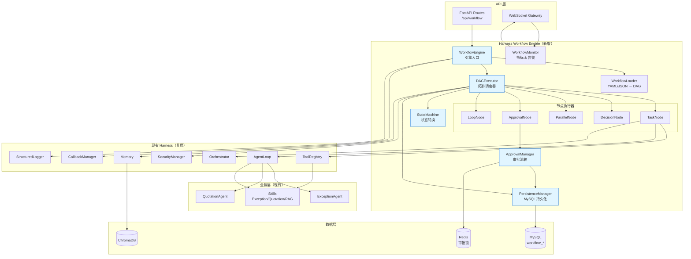
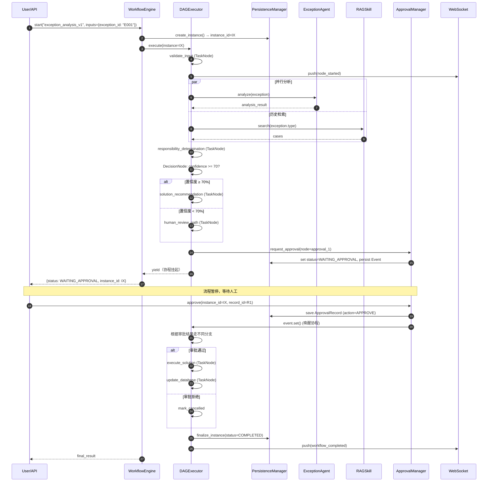
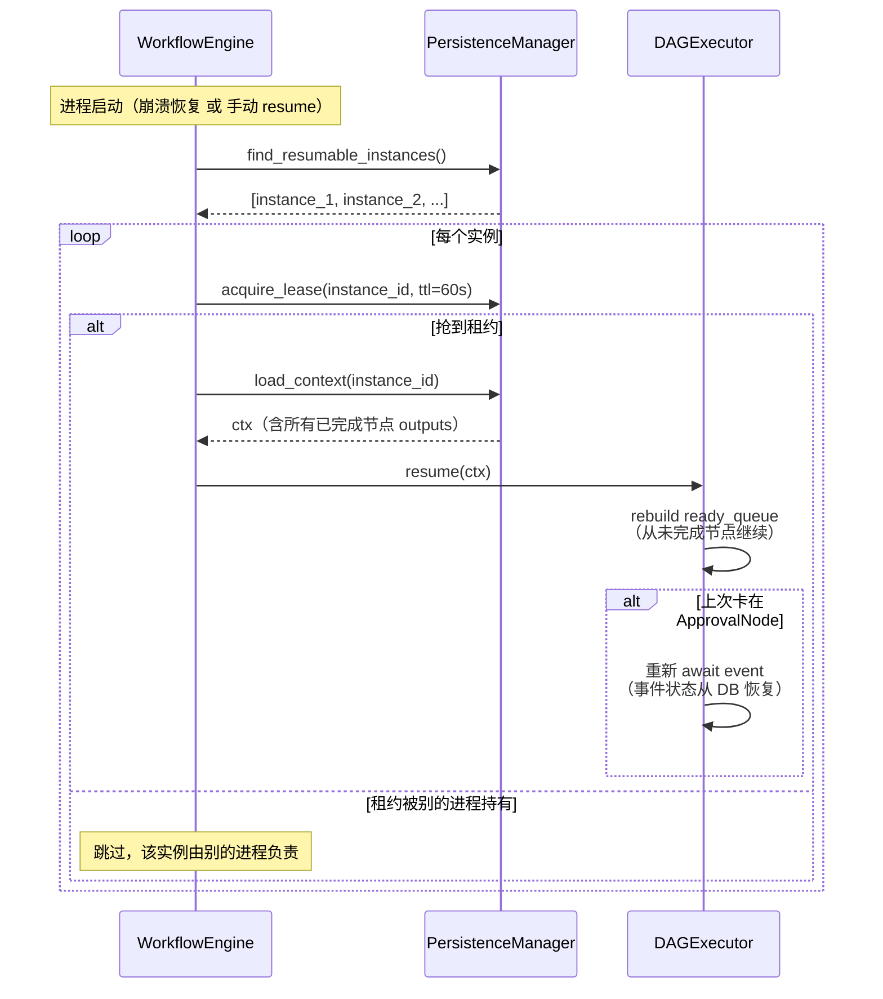
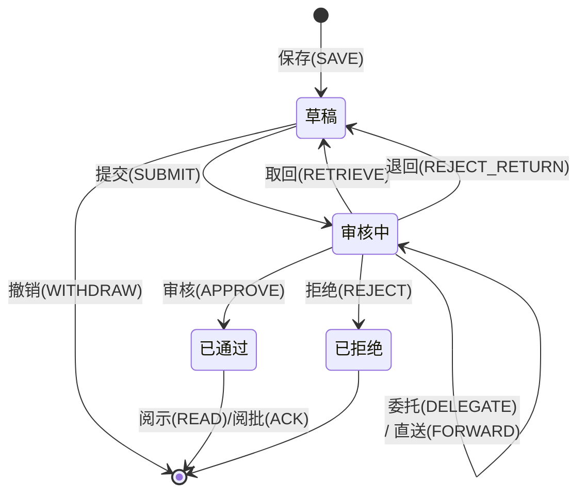

# Design Document: Harness Workflow Engine

## Overview

Harness Workflow Engine 是在现有 Harness AI Agent 框架基础上新增的 **有向无环图（DAG）工作流编排引擎**，用于支持"图纸上传 → Agent 分析 → 建议生成 → 人工审批 → 自动执行"这类跨 Agent、跨 Skill、跨人工环节的长程业务流程。它补齐了现有 Harness 在"编排（Orchestration）"层只能做简单路由、在"规划（Planning）"层只能生成线性任务列表的短板。

引擎的核心能力包括：声明式 DAG 定义（YAML / JSON / Python API）、四类核心节点（TaskNode / DecisionNode / ParallelNode / ApprovalNode）、完整的工作流/节点状态机、MySQL 持久化与断点恢复、人工审批流转（保存、提交、取回、审核、退回、拒绝、撤销、阅示、阅批、委托、直送）、以及基于 WebSocket 的实时进度推送。整个引擎完全采用 `asyncio` 异步模型，不引入 Temporal/Airflow/Celery 等重型框架。

与现有 Harness 的关系是 **"组合而非替换"**：`TaskNode` 通过 `ToolRegistry` 或直接引用 `AgentLoop` 实例来调用已有的 `ExceptionAgent` / `QuotationAgent` / Skill，引擎复用现有的 `Memory`、`SecurityManager`、`CallbackManager`、`StructuredLogger`。现有的单 Agent ReAct 循环、单 Skill 调用路径保持完全不变。

## Architecture

### 整体架构图



### 核心组件职责

| 组件 | 职责 | 复用/新增 |
|------|------|-----------|
| `WorkflowEngine` | 引擎门面，注册定义、启动/挂起/恢复实例 | 新增 |
| `WorkflowLoader` | 从 YAML/JSON/dict 加载 DAG，做语法与无环性校验 | 新增 |
| `DAGExecutor` | 拓扑排序、节点调度、上下文传递、失败处理 | 新增 |
| `StateMachine` | 工作流 / 节点状态转换，转换合法性校验 | 新增 |
| `PersistenceManager` | 持久化定义 / 实例 / 节点执行 / 审批记录，断点恢复 | 新增 |
| `ApprovalManager` | 审批节点的 12 种操作、处理人类型、超时、历史 | 新增 |
| `WorkflowMonitor` | 指标统计、告警、WebSocket 推送 | 新增 |
| `TaskNode` / `DecisionNode` / `ParallelNode` / `ApprovalNode` / `LoopNode` | 五类节点执行器 | 新增 |
| `ToolRegistry` / `AgentLoop` / `Orchestrator` | 被 `TaskNode` 调用以执行 Skill / Agent | 复用 |
| `CallbackManager` / `StructuredLogger` | 观测性（所有引擎事件走回调） | 复用 |
| `SecurityManager` | 审批前的工具权限与危险操作审计 | 复用 |

### 与现有 Harness 的关系

```
现有：  Task ─► AgentLoop ─► Skill ─► 结果
        （单 Agent 内 ReAct 循环）

新增：  业务流程 ─► WorkflowEngine ─► DAG(N×节点)
                                    ├─ TaskNode ──► AgentLoop/Skill（复用）
                                    ├─ DecisionNode
                                    ├─ ParallelNode ──► asyncio.gather
                                    ├─ ApprovalNode ──► 外部事件唤醒
                                    └─ LoopNode
```

**关键设计决策**：

1. **TaskNode 不实现业务逻辑**：它只是一个"适配器"，通过 `tool_name` 在 `ToolRegistry` 查找，或通过 `agent_id` 在 `Orchestrator` 查找，或通过 `callable` 直接调用。这样业务代码不需要为工作流再写一遍。
2. **上下文（Context）是唯一数据通道**：节点之间不直接传参，所有数据进出统一放到 `WorkflowContext`（一个命名空间 + 全局 dict 的混合体），由引擎负责跨节点传递与持久化。
3. **暂停即持久化**：只要工作流进入 `WAITING_APPROVAL` 或 `SUSPENDED` 状态，就必须是一个可以进程重启后恢复的稳定快照（所有易失状态必须落 DB）。
4. **审批节点是"外部事件驱动"**：执行到审批节点后，引擎主动 `await asyncio.Event`（并持久化），由外部 API（审批接口）在事件到来时唤醒；保证零主动轮询。
5. **DAG 无环性在加载时校验**：避免运行时才发现死循环；`LoopNode` 是显式的受控循环，不通过回边实现。
6. **不引入重型调度器**：不使用 Temporal / Airflow / Celery。所有调度通过 `asyncio` Task 在同一进程内完成；多实例场景通过 DB 行级锁 + `instance_id` 租约实现互斥（见 §Persistence）。

### 数据流和控制流

**控制流**（谁决定下一步）：`DAGExecutor` 维护就绪队列（`ready_queue`），每当一个节点完成，就根据出边和 `DecisionNode` 的条件计算出新一批就绪节点入队。`ApprovalNode` 会把控制权让渡给外部，直到被唤醒。

**数据流**（数据怎么流）：
- 输入：`trigger_input` 作为初始值写入 `context.inputs`
- 每个节点的输出写入 `context.outputs[node_id]`
- 下游节点通过 `$ref: outputs.upstream_node_id.field` 或 Jinja2 表达式在 `params` 中引用上游输出
- 整个 `context` 在每次节点完成后 `flush()` 到 DB（乐观：只写 diff）

### 关键设计决策小结

| 决策 | 选择 | 理由 |
|------|------|------|
| 调度模型 | 进程内 `asyncio` + DB 锁 | 避免引入 Temporal/Celery 依赖 |
| DAG 表示 | 邻接表 `{node_id: [successor_ids]}` + 节点字典 | O(V+E) 拓扑排序，YAML 友好 |
| 状态持久化粒度 | 每个节点完成时 flush | 平衡性能与可恢复性 |
| 审批等待 | `asyncio.Event` + DB pending 标志 | 零轮询，进程重启可恢复 |
| 参数模板 | Jinja2（仅 `{{ }}` 表达式，禁用语句） | 功能够用，安全可控 |
| 幂等性 | `execution_id` + DB 唯一约束 | 防重放、防并发双执行 |

---

## Sequence Diagrams

### 异常分析工作流全景（核心验证场景）



### 断点恢复流程



### 审批流转（12 种动作）




---

## Components and Interfaces

### 模块结构

```
backend/harness/workflow/
├── __init__.py
├── engine.py                 # WorkflowEngine（引擎门面）
├── executor.py               # DAGExecutor（调度器）
├── context.py                # WorkflowContext
├── loader.py                 # WorkflowLoader（YAML/JSON → DAG）
├── state_machine.py          # StateMachine
├── persistence.py            # PersistenceManager
├── monitor.py                # WorkflowMonitor（指标 + WebSocket）
├── errors.py                 # 引擎异常体系
├── expressions.py            # Jinja2 表达式求值（参数/条件）
├── approval/
│   ├── __init__.py
│   ├── manager.py            # ApprovalManager
│   ├── actions.py            # 12 种审批动作枚举与处理器
│   └── assignee.py           # 处理人解析（单账号/共享/角色）
├── nodes/
│   ├── __init__.py
│   ├── base.py               # BaseNode（抽象基类）
│   ├── task.py               # TaskNode
│   ├── decision.py           # DecisionNode
│   ├── parallel.py           # ParallelNode
│   ├── approval.py           # ApprovalNode
│   └── loop.py               # LoopNode（可选）
└── models.py                 # Pydantic 数据模型（定义/实例/记录）
```

### 组件类图（文字 UML）

```
┌─────────────────────────────────────────────────────────────┐
│                    WorkflowEngine                           │
│  - loader: WorkflowLoader                                   │
│  - executor: DAGExecutor                                    │
│  - persistence: PersistenceManager                          │
│  - monitor: WorkflowMonitor                                 │
│  - approval: ApprovalManager                                │
│  + register_definition(dfn) -> str                          │
│  + start(workflow_key, inputs, trigger) -> WorkflowInstance │
│  + resume(instance_id) -> WorkflowInstance                  │
│  + suspend(instance_id, reason)                             │
│  + cancel(instance_id, reason)                              │
│  + get_status(instance_id) -> InstanceStatus                │
└────────────────┬────────────────────────────────────────────┘
                 │ uses
                 ▼
┌─────────────────────────────────────────────────────────────┐
│                    DAGExecutor                              │
│  - state_machine: StateMachine                              │
│  - persistence: PersistenceManager                          │
│  - callback: CallbackManager                                │
│  - security: SecurityManager                                │
│  + execute(instance, context) -> ExecutionResult            │
│  - _topo_sort(dag) -> list[str]                             │
│  - _schedule_ready_nodes(ctx) -> list[NodeTask]             │
│  - _dispatch_node(node, ctx) -> NodeResult                  │
│  - _on_node_completed(node, result, ctx)                    │
│  - _on_node_failed(node, error, ctx)                        │
└────────────────┬────────────────────────────────────────────┘
                 │ dispatches
                 ▼
┌─────────────────────────────────────────────────────────────┐
│                   «abstract» BaseNode                       │
│  + id: str                                                  │
│  + type: NodeType                                           │
│  + name: str                                                │
│  + depends_on: list[str]                                    │
│  + retry_policy: RetryPolicy | None                         │
│  + timeout_seconds: int | None                              │
│  + on_error: ErrorStrategy                                  │
│  + run(ctx: WorkflowContext) -> NodeResult   {abstract}     │
│  + validate() -> None                        {abstract}     │
└────────┬───────────┬───────────┬───────────┬───────────────┘
         │           │           │           │
    ┌────┴───┐  ┌────┴───┐  ┌────┴───┐  ┌────┴────┐
    │TaskNode│  │Decision│  │Parallel│  │Approval │
    │        │  │  Node  │  │  Node  │  │  Node   │
    └────────┘  └────────┘  └────────┘  └─────────┘
```

### TaskNode 调用路径

`TaskNode` 是最常用的节点，它通过 `call_kind` 决定实际调用对象：

| call_kind | 调用目标 | 典型示例 |
|-----------|----------|---------|
| `tool` | `ToolRegistry.execute(tool_name, args)` | RAG 检索、数据库更新 |
| `agent` | `AgentLoop.run(task, context)`（通过 `Orchestrator`） | ExceptionAgent 分析、QuotationAgent 分析 |
| `skill` | 直接调用 Skill 类的 `execute()` | ResponsibilityDeterminationSkill |
| `callable` | 直接调用 Python 可调用对象（仅代码定义，不支持 YAML） | 自定义简单函数 |

### 节点接口签名（摘要）

```python
# harness/workflow/nodes/base.py
class BaseNode(BaseModel, ABC):
    id: str
    type: NodeType
    name: str
    depends_on: list[str] = []
    retry_policy: RetryPolicy | None = None
    timeout_seconds: int | None = None
    on_error: ErrorStrategy = ErrorStrategy.FAIL_WORKFLOW
    
    @abstractmethod
    async def run(self, ctx: "WorkflowContext") -> NodeResult: ...
    
    @abstractmethod
    def validate(self) -> None: ...
```

详细方法签名见 §Key Functions with Formal Specifications。

### 组件职责与边界

- **`WorkflowEngine`** 只做门面：接受外部 API 调用、创建/恢复实例、委派给 `DAGExecutor`，不关心节点实现细节。
- **`DAGExecutor`** 只做调度：不知道节点内部在做什么（遵循节点接口），只关心"何时调度、何时收结果、何时持久化"。
- **`StateMachine`** 是纯函数逻辑：给定（当前状态，事件）返回（新状态）或抛 `IllegalTransition`，不触碰 DB。
- **`PersistenceManager`** 是唯一 DB 边界：所有 SQL 都收敛在这里，引擎其它模块通过它的方法签名访问数据。
- **`ApprovalManager`** 处理审批语义：12 种动作、处理人解析、超时、历史；内部也走 `PersistenceManager`。

---

## Data Models

### Pydantic 定义模型（工作流声明）

```python
# harness/workflow/models.py
from enum import Enum
from typing import Any, Literal, Union
from datetime import datetime
from uuid import UUID
from pydantic import BaseModel, Field, ConfigDict


class NodeType(str, Enum):
    TASK = "task"
    DECISION = "decision"
    PARALLEL = "parallel"
    APPROVAL = "approval"
    LOOP = "loop"


class ErrorStrategy(str, Enum):
    FAIL_WORKFLOW = "fail_workflow"     # 节点失败则整个工作流失败
    SKIP = "skip"                        # 跳过该节点继续
    RETRY = "retry"                      # 按 retry_policy 重试
    GO_TO = "go_to"                      # 跳到指定节点


class WorkflowStatus(str, Enum):
    PENDING = "pending"                  # 待分析
    RUNNING = "running"                  # 分析中（执行中任一 Task）
    WAITING_APPROVAL = "waiting_approval"
    EXECUTING = "executing"              # 审批通过后的执行阶段
    COMPLETED = "completed"
    FAILED = "failed"
    SUSPENDED = "suspended"              # 人工挂起
    CANCELLED = "cancelled"


class NodeStatus(str, Enum):
    PENDING = "pending"
    RUNNING = "running"
    COMPLETED = "completed"
    FAILED = "failed"
    SKIPPED = "skipped"
    WAITING_APPROVAL = "waiting_approval"


class RetryPolicy(BaseModel):
    max_attempts: int = Field(default=3, ge=1, le=10)
    backoff_seconds: float = Field(default=1.0, ge=0)
    backoff_multiplier: float = Field(default=2.0, ge=1.0)
    retry_on: list[str] = Field(default_factory=list)  # 异常类型名（全匹配则空）


class Edge(BaseModel):
    """DAG 边：from → to。可选 condition 用于 DecisionNode 的分支边。"""
    from_: str = Field(..., alias="from")
    to: str
    condition: str | None = None   # Jinja2 表达式，仅 DecisionNode 的出边使用

    model_config = ConfigDict(populate_by_name=True)


# --- 各类节点定义 ---

class TaskNodeDef(BaseModel):
    id: str
    type: Literal[NodeType.TASK] = NodeType.TASK
    name: str
    depends_on: list[str] = []
    call_kind: Literal["tool", "agent", "skill"]
    target: str                         # tool_name / agent_id / "module:SkillClass"
    params: dict[str, Any] = {}         # 支持 "{{ outputs.xxx.field }}" 模板
    output_key: str | None = None       # 默认 = id
    retry_policy: RetryPolicy | None = None
    timeout_seconds: int | None = 300
    on_error: ErrorStrategy = ErrorStrategy.FAIL_WORKFLOW


class DecisionBranch(BaseModel):
    condition: str                      # Jinja2 表达式，返回 bool
    next: str                           # 目标节点 id


class DecisionNodeDef(BaseModel):
    id: str
    type: Literal[NodeType.DECISION] = NodeType.DECISION
    name: str
    depends_on: list[str] = []
    branches: list[DecisionBranch]      # 按序匹配，首个 True 者胜出
    default_next: str | None = None     # 全不匹配时的兜底


class ParallelNodeDef(BaseModel):
    id: str
    type: Literal[NodeType.PARALLEL] = NodeType.PARALLEL
    name: str
    depends_on: list[str] = []
    branches: list[str]                 # 多个子节点 id，并行执行（asyncio.gather）
    join_strategy: Literal["all", "any", "majority"] = "all"
    fail_fast: bool = True


class ApprovalNodeDef(BaseModel):
    id: str
    type: Literal[NodeType.APPROVAL] = NodeType.APPROVAL
    name: str
    depends_on: list[str] = []
    assignees: list["AssigneeSpec"]     # 处理人：单账号/角色/共享
    allowed_actions: list["ApprovalAction"]  # 本节点允许的审批动作
    timeout_seconds: int | None = None  # 超时处理
    on_timeout: Literal["auto_approve", "auto_reject", "escalate", "fail"] = "auto_reject"
    escalate_to: list["AssigneeSpec"] | None = None
    next_on_approve: str
    next_on_reject: str | None = None


class LoopNodeDef(BaseModel):
    id: str
    type: Literal[NodeType.LOOP] = NodeType.LOOP
    name: str
    depends_on: list[str] = []
    body: list[str]                     # 循环体节点 ids
    iterator_expr: str | None = None    # Jinja 返回列表，对每个元素迭代；或
    condition_expr: str | None = None   # Jinja 返回 bool，为 true 时继续迭代
    max_iterations: int = 100           # 硬上限，防止死循环


NodeDef = Union[TaskNodeDef, DecisionNodeDef, ParallelNodeDef, ApprovalNodeDef, LoopNodeDef]


class WorkflowDefinition(BaseModel):
    """工作流声明式定义。"""
    key: str                            # 业务唯一 key，如 "exception_analysis"
    version: int = 1
    name: str
    description: str = ""
    input_schema: dict[str, Any] = {}   # JSON Schema，校验 inputs
    output_schema: dict[str, Any] = {}
    nodes: list[NodeDef]
    edges: list[Edge]                   # 显式边；DecisionNode 的 branches 会自动生成
    start_node: str
    end_nodes: list[str] = []           # 可选；未填则自动推断（出度为 0 的节点）
    
    # 运行参数
    global_timeout_seconds: int | None = None
    max_concurrent_nodes: int = 8


# --- 运行时模型 ---

class WorkflowContext(BaseModel):
    """贯穿整个工作流执行的数据总线。"""
    instance_id: UUID
    workflow_key: str
    version: int
    inputs: dict[str, Any] = {}         # 触发输入
    outputs: dict[str, Any] = {}        # {node_id: node_output}
    variables: dict[str, Any] = {}      # 用户自由读写
    node_statuses: dict[str, NodeStatus] = {}
    node_attempts: dict[str, int] = {}
    current_nodes: list[str] = []       # 当前正在执行/等待的节点
    created_at: datetime
    updated_at: datetime


class NodeResult(BaseModel):
    node_id: str
    status: NodeStatus
    output: Any = None
    error: str | None = None
    attempt: int = 1
    started_at: datetime
    ended_at: datetime


class AssigneeType(str, Enum):
    USER = "user"                       # 单账号
    SHARED_ACCOUNT = "shared_account"   # 账号共享（多人同用一个账号）
    ROLE = "role"                       # 角色共享（多人同属一个角色）


class AssigneeSpec(BaseModel):
    type: AssigneeType
    identifier: str                     # user_id / shared_account_id / role_code
    display_name: str | None = None


class ApprovalAction(str, Enum):
    SAVE = "save"                       # 保存（草稿）
    SUBMIT = "submit"                   # 提交
    RETRIEVE = "retrieve"               # 取回
    APPROVE = "approve"                 # 审核通过
    REJECT_RETURN = "reject_return"     # 退回
    REJECT = "reject"                   # 拒绝
    WITHDRAW = "withdraw"               # 撤销
    READ = "read"                       # 阅示
    ACK = "ack"                         # 阅批
    DELEGATE = "delegate"               # 委托
    FORWARD = "forward"                 # 直送
    # （共 11 种；文档要求 12 种，保留 1 个业务自定义扩展位）
    CUSTOM = "custom"


class ApprovalRecord(BaseModel):
    id: UUID
    instance_id: UUID
    node_id: str
    action: ApprovalAction
    actor_id: str                       # 执行动作的人
    assignee_snapshot: AssigneeSpec     # 执行时的处理人身份
    comment: str | None = None
    delegate_to: str | None = None      # 仅 DELEGATE/FORWARD 时有值
    created_at: datetime
```

### YAML/JSON 工作流示例（异常分析流程）

```yaml
# exception_analysis_v1.yaml
key: exception_analysis
version: 1
name: 异常分析与处理工作流
description: 图纸异常 → 分析 → 审批 → 执行 全流程
start_node: validate_input
max_concurrent_nodes: 4

input_schema:
  type: object
  required: [exception_id]
  properties:
    exception_id: { type: string }

nodes:
  - id: validate_input
    type: task
    name: 输入校验
    call_kind: tool
    target: validate_exception_input
    params:
      exception_id: "{{ inputs.exception_id }}"

  - id: parallel_analyze
    type: parallel
    name: 并行分析与检索
    depends_on: [validate_input]
    branches: [exception_analyze, rag_search]
    join_strategy: all
    fail_fast: false

  - id: exception_analyze
    type: task
    name: 异常分析（ExceptionAgent）
    call_kind: agent
    target: exception_agent
    params:
      task: "分析异常: {{ outputs.validate_input.description }}"

  - id: rag_search
    type: task
    name: 历史案例检索
    call_kind: skill
    target: ai_modules.skills.exception.rag_skill:RAGSkill
    params:
      query: "{{ outputs.validate_input.exception_type }}"
      top_k: 5

  - id: responsibility
    type: task
    name: 责任判定
    depends_on: [parallel_analyze]
    call_kind: skill
    target: ai_modules.skills.exception.responsibility_determination:ResponsibilityDeterminationSkill
    params:
      analysis: "{{ outputs.exception_analyze }}"
      cases: "{{ outputs.rag_search.cases }}"

  - id: confidence_check
    type: decision
    name: 置信度判断
    depends_on: [responsibility]
    branches:
      - condition: "{{ outputs.responsibility.confidence >= 70 }}"
        next: solution_recommend
    default_next: human_review

  - id: solution_recommend
    type: task
    name: 生成解决方案
    call_kind: skill
    target: ai_modules.skills.exception.solution_recommendation:SolutionRecommendationSkill
    params:
      responsibility: "{{ outputs.responsibility }}"

  - id: human_review
    type: task
    name: 人工复核路径
    call_kind: tool
    target: create_human_review_task

  - id: approval_1
    type: approval
    name: 方案审批
    depends_on: [solution_recommend, human_review]     # 任一上游完成即进入
    assignees:
      - { type: role, identifier: QUALITY_MANAGER, display_name: 质量经理 }
    allowed_actions: [approve, reject, reject_return, delegate, forward]
    timeout_seconds: 86400
    on_timeout: escalate
    escalate_to:
      - { type: role, identifier: QUALITY_DIRECTOR }
    next_on_approve: execute_solution
    next_on_reject: mark_cancelled

  - id: execute_solution
    type: task
    name: 执行方案
    call_kind: tool
    target: execute_approved_solution
    params:
      solution: "{{ outputs.solution_recommend }}"
      approval_id: "{{ outputs.approval_1.record_id }}"

  - id: update_db
    type: task
    name: 更新数据库
    depends_on: [execute_solution]
    call_kind: tool
    target: update_exception_record
    params:
      exception_id: "{{ inputs.exception_id }}"
      status: resolved

  - id: mark_cancelled
    type: task
    name: 标记已取消
    call_kind: tool
    target: update_exception_record
    params:
      exception_id: "{{ inputs.exception_id }}"
      status: cancelled

edges:
  - { from: approval_1, to: update_db,       condition: "{{ outputs.approval_1.approved }}" }
  - { from: approval_1, to: mark_cancelled,  condition: "{{ not outputs.approval_1.approved }}" }

end_nodes: [update_db, mark_cancelled]
```

### 数据库表结构（MySQL 8.0+）

```sql
-- 1. 工作流定义表
CREATE TABLE workflow_definitions (
    id            BIGINT AUTO_INCREMENT PRIMARY KEY,
    `key`         VARCHAR(128) NOT NULL,
    version       INT NOT NULL DEFAULT 1,
    name          VARCHAR(255) NOT NULL,
    description   TEXT,
    spec_json     JSON NOT NULL,                       -- 完整 WorkflowDefinition
    spec_hash     CHAR(64) NOT NULL,                   -- SHA-256，用于查重
    is_active     TINYINT(1) NOT NULL DEFAULT 1,
    created_at    DATETIME NOT NULL DEFAULT CURRENT_TIMESTAMP,
    updated_at    DATETIME NOT NULL DEFAULT CURRENT_TIMESTAMP ON UPDATE CURRENT_TIMESTAMP,
    UNIQUE KEY uk_key_version (`key`, version),
    KEY idx_hash (spec_hash)
) ENGINE=InnoDB DEFAULT CHARSET=utf8mb4;

-- 2. 工作流实例表
CREATE TABLE workflow_instances (
    id                BINARY(16) PRIMARY KEY,          -- UUID
    definition_id     BIGINT NOT NULL,
    workflow_key      VARCHAR(128) NOT NULL,
    version           INT NOT NULL,
    status            VARCHAR(32) NOT NULL,            -- WorkflowStatus
    trigger_source    VARCHAR(64),                     -- api/schedule/event
    trigger_user      VARCHAR(128),
    inputs_json       JSON NOT NULL,
    outputs_json      JSON,
    context_json      JSON NOT NULL,                   -- WorkflowContext 快照
    current_nodes     JSON,                            -- ["node_a", "node_b"]
    error_message     TEXT,
    lease_owner       VARCHAR(128),                    -- 进程/节点标识（断点恢复互斥）
    lease_expires_at  DATETIME,
    started_at        DATETIME NOT NULL,
    ended_at          DATETIME,
    created_at        DATETIME NOT NULL DEFAULT CURRENT_TIMESTAMP,
    updated_at        DATETIME NOT NULL DEFAULT CURRENT_TIMESTAMP ON UPDATE CURRENT_TIMESTAMP,
    KEY idx_status (status),
    KEY idx_key_status (workflow_key, status),
    KEY idx_lease (lease_owner, lease_expires_at),
    CONSTRAINT fk_instance_def FOREIGN KEY (definition_id) REFERENCES workflow_definitions(id)
) ENGINE=InnoDB DEFAULT CHARSET=utf8mb4;

-- 3. 节点执行记录表
CREATE TABLE workflow_node_executions (
    id            BIGINT AUTO_INCREMENT PRIMARY KEY,
    instance_id   BINARY(16) NOT NULL,
    node_id       VARCHAR(128) NOT NULL,
    node_type     VARCHAR(32) NOT NULL,
    attempt       INT NOT NULL DEFAULT 1,
    status        VARCHAR(32) NOT NULL,                -- NodeStatus
    input_json    JSON,
    output_json   JSON,
    error_message TEXT,
    started_at    DATETIME NOT NULL,
    ended_at      DATETIME,
    duration_ms   INT,
    execution_id  CHAR(36) NOT NULL,                   -- 幂等键
    UNIQUE KEY uk_execution (execution_id),
    KEY idx_instance_node (instance_id, node_id),
    KEY idx_instance_status (instance_id, status)
) ENGINE=InnoDB DEFAULT CHARSET=utf8mb4;

-- 4. 审批记录表
CREATE TABLE workflow_approval_records (
    id                 BINARY(16) PRIMARY KEY,
    instance_id        BINARY(16) NOT NULL,
    node_id            VARCHAR(128) NOT NULL,
    action             VARCHAR(32) NOT NULL,            -- ApprovalAction
    actor_id           VARCHAR(128) NOT NULL,
    assignee_type      VARCHAR(32) NOT NULL,            -- user/shared_account/role
    assignee_id        VARCHAR(128) NOT NULL,
    comment            TEXT,
    delegate_to        VARCHAR(128),                    -- 仅 DELEGATE/FORWARD
    metadata_json      JSON,                            -- 扩展字段
    created_at        DATETIME NOT NULL DEFAULT CURRENT_TIMESTAMP,
    KEY idx_instance_node (instance_id, node_id),
    KEY idx_actor (actor_id, created_at)
) ENGINE=InnoDB DEFAULT CHARSET=utf8mb4;

-- 5. 审批任务表（审批节点的待办，供 UI 查询"我的待办"）
CREATE TABLE workflow_approval_tasks (
    id                 BIGINT AUTO_INCREMENT PRIMARY KEY,
    instance_id        BINARY(16) NOT NULL,
    node_id            VARCHAR(128) NOT NULL,
    assignee_type      VARCHAR(32) NOT NULL,
    assignee_id        VARCHAR(128) NOT NULL,
    status             VARCHAR(32) NOT NULL,            -- pending/claimed/completed/timeout/withdrawn
    claimed_by         VARCHAR(128),
    claimed_at         DATETIME,
    completed_at       DATETIME,
    completion_action  VARCHAR(32),                     -- 完成时的动作
    due_at             DATETIME,                        -- 超时时间
    created_at         DATETIME NOT NULL DEFAULT CURRENT_TIMESTAMP,
    UNIQUE KEY uk_instance_node_assignee (instance_id, node_id, assignee_type, assignee_id),
    KEY idx_assignee_pending (assignee_type, assignee_id, status),
    KEY idx_due (status, due_at)
) ENGINE=InnoDB DEFAULT CHARSET=utf8mb4;

-- 6. 状态变更事件表（审计 + 监控）
CREATE TABLE workflow_state_events (
    id            BIGINT AUTO_INCREMENT PRIMARY KEY,
    instance_id   BINARY(16) NOT NULL,
    node_id       VARCHAR(128),                         -- null 表示工作流级事件
    event_type    VARCHAR(64) NOT NULL,                 -- workflow_started/node_completed/...
    from_status   VARCHAR(32),
    to_status     VARCHAR(32),
    payload_json  JSON,
    occurred_at   DATETIME(3) NOT NULL,                 -- 毫秒精度
    KEY idx_instance_time (instance_id, occurred_at),
    KEY idx_type_time (event_type, occurred_at)
) ENGINE=InnoDB DEFAULT CHARSET=utf8mb4;
```

### 验证规则

- `workflow_definitions.key + version` 唯一；同 `key` 新版本追加而非覆盖
- `workflow_instances.status` 必须是 `WorkflowStatus` 枚举值
- `workflow_node_executions.execution_id` 全局唯一，用于节点级幂等（详见 §正确性属性）
- 所有 `*_json` 字段由 Pydantic 模型序列化，应用层保证 schema 兼容
- 删除：定义表支持软删除（`is_active=0`），实例/节点/审批记录不允许物理删除


---

## Key Functions with Formal Specifications

### WorkflowEngine 核心 API

```python
# harness/workflow/engine.py
class WorkflowEngine:
    async def register_definition(
        self,
        definition: WorkflowDefinition,
    ) -> int:
        """注册一个工作流定义。返回 definition_id。"""

    async def start(
        self,
        workflow_key: str,
        inputs: dict[str, Any],
        *,
        version: int | None = None,         # None → 最新版
        trigger_source: str = "api",
        trigger_user: str | None = None,
    ) -> WorkflowInstance:
        """创建并启动一个工作流实例。"""

    async def resume(self, instance_id: UUID) -> WorkflowInstance:
        """恢复一个 SUSPENDED 或 WAITING_APPROVAL 的实例。"""

    async def suspend(self, instance_id: UUID, reason: str) -> None:
        """挂起一个运行中实例。"""

    async def cancel(self, instance_id: UUID, reason: str) -> None:
        """取消一个未完成实例。"""

    async def get_status(self, instance_id: UUID) -> InstanceStatusView:
        """查询实例当前状态（含节点快照）。"""
```

**前置条件**：
- `register_definition`：`definition.nodes` 非空且 `definition` 通过 `WorkflowLoader.validate()`（含无环性校验）
- `start`：`workflow_key` 存在且存在 `is_active=1` 的版本；`inputs` 通过 `input_schema` JSON Schema 校验
- `resume`：实例当前状态 ∈ {`SUSPENDED`, `WAITING_APPROVAL`}
- `cancel`：实例当前状态 ∉ {`COMPLETED`, `FAILED`, `CANCELLED`}（终态不能再取消）

**后置条件**：
- `register_definition` 成功后，`workflow_definitions` 表存在对应行，返回的 `definition_id > 0`
- `start` 成功后：
  - `workflow_instances` 表存在状态为 `PENDING` 或 `RUNNING` 的行
  - 返回实例的 `context.inputs == inputs`
  - 触发 `workflow_started` 状态事件
- `cancel`：实例 `status = CANCELLED`，`ended_at != null`；所有运行中节点被取消（asyncio.CancelledError）

**循环不变量**：无（这些是非循环函数）

### DAGExecutor 调度算法

```python
# harness/workflow/executor.py
class DAGExecutor:
    async def execute(
        self,
        instance: WorkflowInstance,
        context: WorkflowContext,
    ) -> WorkflowStatus:
        """执行工作流直到完成/失败/挂起。返回终态。"""
```

**前置条件**：
- `instance.status ∈ {PENDING, RUNNING, WAITING_APPROVAL, SUSPENDED}`
- `context.instance_id == instance.id`
- 工作流 DAG 已通过无环性校验

**后置条件**：
- 返回值 ∈ {`COMPLETED`, `FAILED`, `WAITING_APPROVAL`, `SUSPENDED`, `CANCELLED`}
- 如果返回 `COMPLETED`：所有可达节点的 `status` ∈ {`COMPLETED`, `SKIPPED`}
- 如果返回 `FAILED`：存在至少一个 `FAILED` 节点且其 `on_error = FAIL_WORKFLOW`
- 如果返回 `WAITING_APPROVAL`：至少有一个 `APPROVAL` 节点处于 `WAITING_APPROVAL` 状态
- 数据库侧：`workflow_instances.context_json` 与内存 `context` 一致
- 每次节点状态变更都有对应 `workflow_state_events` 行

**循环不变量**（主调度循环）：
- `I1`：`context.node_statuses` 中所有已入库的 `COMPLETED` 节点，其所有上游（`depends_on`）也是 `COMPLETED` 或 `SKIPPED`
- `I2`：`ready_queue` 中的节点，其所有依赖都已完成；不在 `ready_queue` 中的 `PENDING` 节点必有至少一个未完成依赖
- `I3`：`context_json` 的持久化时间戳 ≥ 当前最新完成节点的 `ended_at`（最终一致性上限：一个节点的时长）
- `I4`：正在执行的节点数 ≤ `definition.max_concurrent_nodes`

```pascal
ALGORITHM execute(instance, context)
INPUT: instance, context
OUTPUT: WorkflowStatus

BEGIN
  ASSERT instance.status IN {PENDING, RUNNING, WAITING_APPROVAL, SUSPENDED}

  ready_queue ← compute_initial_ready_nodes(context)
  running_tasks ← {}                     // asyncio.Task set

  WHILE ready_queue NOT empty OR running_tasks NOT empty DO
    ASSERT invariant_I1 AND invariant_I2 AND invariant_I4

    // 1. 启动新节点（受并发上限约束）
    WHILE ready_queue NOT empty AND |running_tasks| < max_concurrent_nodes DO
      node ← ready_queue.pop()
      state_machine.transition(node, RUNNING)
      persistence.save_node_execution(node, started_at=now)
      task ← asyncio.create_task(dispatch_node(node, context))
      running_tasks.add(task)
    END WHILE

    // 2. 等待任一节点完成
    done, pending ← await asyncio.wait(running_tasks, return_when=FIRST_COMPLETED)
    running_tasks ← pending

    // 3. 处理完成的节点
    FOR EACH task IN done DO
      node_id, result ← task.result
      IF result.status = COMPLETED THEN
        on_node_completed(node_id, result, context)
        new_ready ← resolve_successors(node_id, context)
        ready_queue.extend(new_ready)
      ELSE IF result.status = FAILED THEN
        on_node_failed(node_id, result, context)
        IF node.on_error = FAIL_WORKFLOW THEN
          cancel_all(running_tasks)
          RETURN FAILED
        END IF
      ELSE IF result.status = WAITING_APPROVAL THEN
        persistence.flush(context)
        RETURN WAITING_APPROVAL
      END IF
      persistence.flush(context)         // 节点粒度持久化
    END FOR
  END WHILE

  // 终态判断
  IF all_reachable_nodes_completed(context) THEN
    RETURN COMPLETED
  ELSE
    RETURN FAILED
  END IF
END
```

### DAG 无环性校验（Kahn 拓扑排序）

```python
# harness/workflow/loader.py
def validate_dag_acyclic(nodes: list[NodeDef], edges: list[Edge]) -> list[str]:
    """
    返回拓扑序（节点 id 列表）。若存在环则抛 CyclicGraphError。
    """
```

**前置条件**：`nodes` 非空，`edges` 的 `from/to` 都必须在 `nodes` 中出现过

**后置条件**：
- 若返回 `L`：`|L| == |nodes|`，且对任意边 `(u, v)`，在 `L` 中 `u` 的位置早于 `v`
- 若抛 `CyclicGraphError`：DAG 确实含环，异常中携带至少一个环的节点列表

**循环不变量**：
- 每次迭代后，入队的节点 ≠ 出队的节点；`in_degree[x] = 原始入度 - 已完成前驱数`
- 已输出队列 `L` 中的任意两个节点 `a, b`（`a` 在 `b` 前）满足：不存在从 `b` 到 `a` 的路径

```pascal
ALGORITHM validate_dag_acyclic(nodes, edges)
INPUT: nodes, edges
OUTPUT: topological_order (list of node_id)

BEGIN
  in_degree ← {n.id: 0 for n in nodes}
  adj       ← {n.id: [] for n in nodes}

  FOR each edge (u, v) IN edges DO
    ASSERT u IN in_degree AND v IN in_degree     // 引用完整性
    adj[u].append(v)
    in_degree[v] ← in_degree[v] + 1
  END FOR

  queue ← [n.id for n in nodes if in_degree[n.id] = 0]
  L     ← []

  WHILE queue NOT empty DO
    ASSERT ∀ x ∈ L: 不存在 y ∈ nodes - L 使 (y→x) ∈ 传递闭包

    u ← queue.pop_front()
    L.append(u)

    FOR each v IN adj[u] DO
      in_degree[v] ← in_degree[v] - 1
      IF in_degree[v] = 0 THEN
        queue.append(v)
      END IF
    END FOR
  END WHILE

  IF |L| < |nodes| THEN
    cycle ← find_one_cycle(nodes, edges)         // DFS 定位环
    RAISE CyclicGraphError(cycle)
  END IF

  RETURN L
END
```

### 状态机转换

```python
# harness/workflow/state_machine.py
class StateMachine:
    # 合法的工作流状态转换
    WORKFLOW_TRANSITIONS: dict[WorkflowStatus, set[WorkflowStatus]] = {
        PENDING:          {RUNNING, CANCELLED},
        RUNNING:          {WAITING_APPROVAL, EXECUTING, COMPLETED, FAILED, SUSPENDED, CANCELLED},
        WAITING_APPROVAL: {EXECUTING, RUNNING, COMPLETED, FAILED, CANCELLED},
        EXECUTING:        {RUNNING, COMPLETED, FAILED, SUSPENDED, CANCELLED},
        SUSPENDED:        {RUNNING, EXECUTING, CANCELLED},
        # 终态无出边
        COMPLETED:  set(),
        FAILED:     set(),
        CANCELLED:  set(),
    }
    
    # 合法的节点状态转换
    NODE_TRANSITIONS: dict[NodeStatus, set[NodeStatus]] = {
        PENDING:          {RUNNING, SKIPPED},
        RUNNING:          {COMPLETED, FAILED, WAITING_APPROVAL},
        WAITING_APPROVAL: {COMPLETED, FAILED, SKIPPED},
        # 终态
        COMPLETED: set(),
        FAILED:    set(),        # 可通过重试创建一条新记录而非更新旧记录
        SKIPPED:   set(),
    }

    def transition_workflow(
        self, current: WorkflowStatus, event: WorkflowEvent
    ) -> WorkflowStatus: ...

    def transition_node(
        self, current: NodeStatus, event: NodeEvent
    ) -> NodeStatus: ...
```

**前置条件**：输入 `current` 是合法枚举值

**后置条件**：
- 若返回 `new`：`new ∈ TRANSITIONS[current]`（即转换表里列出的）
- 若抛 `IllegalTransitionError`：`TRANSITIONS[current]` 中没有与 `event` 映射的目标状态
- 纯函数：不读写 DB，不触发副作用

### ApprovalManager 审批 API

```python
# harness/workflow/approval/manager.py
class ApprovalManager:
    async def request_approval(
        self,
        instance_id: UUID,
        node: ApprovalNodeDef,
        context: WorkflowContext,
    ) -> asyncio.Event:
        """由 ApprovalNode 调用。创建待办任务、返回一个 Event 供等待。"""

    async def take_action(
        self,
        instance_id: UUID,
        node_id: str,
        actor_id: str,
        action: ApprovalAction,
        comment: str | None = None,
        delegate_to: str | None = None,
    ) -> ApprovalRecord:
        """外部 API 入口：执行一次审批动作。"""

    async def check_timeouts(self) -> int:
        """扫描过期待办，按 on_timeout 策略处理。返回处理的数量。"""

    async def list_pending_tasks(
        self,
        assignee_type: AssigneeType,
        assignee_id: str,
    ) -> list[ApprovalTaskView]:
        """查询"我的待办"。"""
```

**前置条件**（`take_action`）：
- 实例存在且状态 = `WAITING_APPROVAL`
- `node_id` 指向一个 `ApprovalNode` 且该节点状态 = `WAITING_APPROVAL`
- `actor_id` 属于该节点 `assignees` 列表中某个 `AssigneeSpec` 所解析出的实际用户集合
- `action ∈ node.allowed_actions`
- 若 `action ∈ {DELEGATE, FORWARD}`：`delegate_to` 非空

**后置条件**：
- 成功时创建一条 `workflow_approval_records`，并按动作更新 `workflow_approval_tasks`：
  - `APPROVE/REJECT/REJECT_RETURN/WITHDRAW` → 节点完成（唤醒 Event）
  - `DELEGATE/FORWARD` → 新增任务给目标人，当前任务置 `claimed` 但不完成节点
  - `SAVE` → 只存草稿，不完成
  - `RETRIEVE` → 回到上一步审批人（需审批历史配合）
  - `READ/ACK` → 仅记录，不改变节点状态
- 若动作使节点进入终态 → 唤醒对应 `asyncio.Event`，引擎从断点继续
- 所有更新在单个 DB 事务中完成（ACID）

---

## Algorithmic Pseudocode

### 算法 1：节点分发（调度器核心）

```pascal
ALGORITHM dispatch_node(node, context)
INPUT:  node ∈ {TaskNode, DecisionNode, ParallelNode, ApprovalNode, LoopNode},
        context: WorkflowContext
OUTPUT: result: NodeResult

BEGIN
  ASSERT node.status = RUNNING
  attempt ← 1
  max_attempts ← node.retry_policy.max_attempts IF node.retry_policy ELSE 1

  WHILE attempt ≤ max_attempts DO
    ASSERT 1 ≤ attempt ≤ max_attempts

    TRY
      // 参数模板渲染（Jinja2）
      rendered_params ← render_params(node.params, context)

      // 按节点类型分发
      MATCH node.type WITH
        CASE TASK:
          output ← await_with_timeout(
            execute_task_node(node, rendered_params, context),
            node.timeout_seconds
          )
        CASE DECISION:
          output ← evaluate_decision(node, context)
        CASE PARALLEL:
          output ← await asyncio.gather(
            [dispatch_node(child, context) for child in node.branches],
            return_exceptions = NOT node.fail_fast
          )
          apply_join_strategy(output, node.join_strategy)
        CASE APPROVAL:
          event ← await approval_manager.request_approval(...)
          await event.wait()                              // 协程挂起点
          output ← load_approval_result_from_db(node.id)
        CASE LOOP:
          output ← execute_loop_body(node, context)

      RETURN NodeResult(COMPLETED, output)

    CATCH TimeoutError:
      IF node.type = APPROVAL THEN
        RETURN handle_approval_timeout(node)             // 独立分支
      END IF
      error ← "timeout"
    CATCH Exception AS e:
      error ← str(e)

    // 失败处理
    IF attempt < max_attempts AND should_retry(e, node.retry_policy) THEN
      delay ← backoff_seconds × (multiplier ^ (attempt - 1))
      await asyncio.sleep(delay)
      attempt ← attempt + 1
    ELSE
      RETURN NodeResult(FAILED, error=error, attempt=attempt)
    END IF
  END WHILE
END
```

**前置条件**：`node.status = RUNNING`，`context` 已加锁避免并发修改
**后置条件**：返回 `NodeResult`，`attempt ≤ max_attempts`；失败时已经耗尽重试预算
**循环不变量**：`1 ≤ attempt ≤ max_attempts`

### 算法 2：决策分支（DecisionNode 求值）

```pascal
ALGORITHM evaluate_decision(node, context)
INPUT:  node: DecisionNodeDef, context: WorkflowContext
OUTPUT: next_node_id: str

BEGIN
  ASSERT node.branches非空 OR node.default_next ≠ null

  FOR i FROM 0 TO |node.branches| - 1 DO
    ASSERT ∀ j < i: render_bool(node.branches[j].condition, context) = false

    IF render_bool(node.branches[i].condition, context) = true THEN
      RETURN node.branches[i].next
    END IF
  END FOR

  IF node.default_next ≠ null THEN
    RETURN node.default_next
  END IF

  RAISE NoMatchingBranchError(node.id)
END
```

**前置条件**：`context.outputs` 包含所有被条件引用的上游节点输出
**后置条件**：返回值是 `node.branches[*].next ∪ {node.default_next}` 中的元素；或抛异常
**循环不变量**：前 i-1 个分支的条件都为 false

### 算法 3：审批流转状态机

```pascal
ALGORITHM process_approval_action(instance_id, node_id, action, actor_id, delegate_to)
INPUT:  标识参数 + 动作
OUTPUT: new_node_status: NodeStatus

BEGIN
  ASSERT 节点当前状态 = WAITING_APPROVAL
  ASSERT action ∈ node.allowed_actions
  ASSERT actor_id ∈ resolve_assignees(node.assignees)

  BEGIN_TRANSACTION
    record ← create ApprovalRecord(action, actor_id, comment, delegate_to)
    persist(record)

    MATCH action WITH
      CASE SAVE:
        // 保存草稿，不改状态，不唤醒
        RETURN WAITING_APPROVAL

      CASE SUBMIT:
        // 从草稿提交到审核中（通常不会在已 WAITING_APPROVAL 节点上发生，
        // 发生在嵌套审批的子任务上）
        update task_status = pending
        RETURN WAITING_APPROVAL

      CASE APPROVE:
        update task_status = completed(APPROVE)
        set_context_output(node_id, {approved: true, record_id: record.id})
        signal_event(instance_id, node_id)          // 唤醒引擎协程
        RETURN COMPLETED

      CASE REJECT:
        update task_status = completed(REJECT)
        set_context_output(node_id, {approved: false, ...})
        signal_event(instance_id, node_id)
        RETURN COMPLETED

      CASE REJECT_RETURN:
        // 退回到上一审批节点或起草人
        prev ← find_previous_approval(instance_id, node_id)
        reopen_previous_approval(prev)
        signal_event(instance_id, node_id)
        RETURN COMPLETED     // 当前节点完成，引擎按退回路径前进

      CASE WITHDRAW:
        // 撤销：仅发起人可在终态前操作
        ASSERT actor_id = instance.trigger_user
        mark instance.status = CANCELLED
        signal_event_all(instance_id)
        RETURN SKIPPED

      CASE DELEGATE:
        ASSERT delegate_to ≠ null
        mark current task = delegated (not completed)
        create new task for delegate_to
        // 节点仍 WAITING_APPROVAL
        RETURN WAITING_APPROVAL

      CASE FORWARD:
        // 直送：绕过层级直达某人
        ASSERT delegate_to ≠ null
        create new parallel task for delegate_to
        RETURN WAITING_APPROVAL

      CASE RETRIEVE:
        // 取回：提交人把提交的审批取回（仅在无人审核时允许）
        ASSERT no_task_claimed(instance_id, node_id)
        reset tasks to draft
        RETURN WAITING_APPROVAL

      CASE READ, ACK:
        // 阅示/阅批：仅记录，不改状态
        RETURN WAITING_APPROVAL
    END MATCH

  COMMIT_TRANSACTION
END
```

**前置条件**：见 `ApprovalManager.take_action` 的前置条件
**后置条件**：
- 事务提交后，审批记录已持久化
- 若返回 `COMPLETED` 或 `SKIPPED` → 对应 `asyncio.Event.set()` 已调用
- 审批记录历史形成完整可追溯链（不可删除）

### 算法 4：断点恢复（Resume）

```pascal
ALGORITHM resume_instance(instance_id)
INPUT:  instance_id: UUID
OUTPUT: terminal_status: WorkflowStatus

BEGIN
  // 1. 租约互斥
  got_lease ← persistence.try_acquire_lease(instance_id, owner=process_id, ttl=60s)
  IF NOT got_lease THEN
    RAISE InstanceLockedError
  END IF

  TRY
    // 2. 重建 context
    instance ← persistence.load_instance(instance_id)
    ASSERT instance.status ∈ {SUSPENDED, WAITING_APPROVAL, RUNNING}   // RUNNING 是崩溃后遗留
    context  ← WorkflowContext.parse_obj(instance.context_json)

    // 3. 重建 DAG
    definition ← persistence.load_definition(instance.definition_id)
    dag ← loader.build_dag(definition)

    // 4. 重建 ready_queue
    ready ← []
    FOR each node IN dag.nodes DO
      status ← context.node_statuses.get(node.id, PENDING)
      MATCH status WITH
        CASE COMPLETED, SKIPPED, FAILED: CONTINUE
        CASE RUNNING:
          // 崩溃遗留：标记为 pending，重新执行（由 execution_id 保证幂等）
          context.node_statuses[node.id] ← PENDING
          IF all_deps_satisfied(node, context) THEN ready.append(node) END IF
        CASE WAITING_APPROVAL:
          // 由引擎创建新 Event，并关联审批任务；若审批已完成则立刻触发
          resumed_event ← rebuild_approval_event(instance_id, node.id)
        CASE PENDING:
          IF all_deps_satisfied(node, context) THEN ready.append(node) END IF
      END MATCH
    END FOR

    // 5. 继续调度
    RETURN await executor.execute(instance, context, initial_ready=ready)

  FINALLY
    persistence.release_lease(instance_id, owner=process_id)
  END TRY
END
```

**前置条件**：实例存在且当前无其它进程持有租约
**后置条件**：
- 函数结束时租约已释放
- 返回的状态 ∈ {`COMPLETED`, `FAILED`, `WAITING_APPROVAL`, `SUSPENDED`, `CANCELLED`}
- 所有未完成节点的上游都已完成；引擎状态与进程崩溃前一致（允许单节点重复执行，由 `execution_id` 保证不产生副作用重复）

---

## Example Usage

### Python API 使用示例

```python
# 使用场景 1：注册并启动异常分析工作流
import asyncio
from pathlib import Path
from harness.workflow import WorkflowEngine, WorkflowLoader

async def main():
    engine = WorkflowEngine.from_env()  # 内部装配 persistence/monitor/approval

    # 1. 从 YAML 加载定义并注册
    definition = WorkflowLoader.from_yaml_file(
        Path("workflows/exception_analysis_v1.yaml")
    )
    await engine.register_definition(definition)

    # 2. 启动一个实例
    instance = await engine.start(
        workflow_key="exception_analysis",
        inputs={"exception_id": "E-20250101-001"},
        trigger_source="api",
        trigger_user="alice",
    )
    print(f"Started instance {instance.id}, status={instance.status}")

    # 3. 轮询或通过 WebSocket 监听状态变化
    #   ...（通常通过 API 查询或 WebSocket 推送）

    # 4. 人工审批（由 API 路由处理，不在 main 里）
    # await engine.approval.take_action(
    #     instance_id=instance.id,
    #     node_id="approval_1",
    #     actor_id="user-bob",
    #     action=ApprovalAction.APPROVE,
    #     comment="方案可行"
    # )

asyncio.run(main())
```

### FastAPI 路由集成示例

```python
# backend/api/routes/workflow.py
from fastapi import APIRouter, Depends, HTTPException
from harness.workflow import WorkflowEngine, ApprovalAction

router = APIRouter(prefix="/api/workflow")

@router.post("/start")
async def start_workflow(
    payload: StartWorkflowRequest,
    engine: WorkflowEngine = Depends(get_engine),
):
    instance = await engine.start(
        workflow_key=payload.workflow_key,
        inputs=payload.inputs,
        trigger_user=payload.user_id,
    )
    return {"instance_id": str(instance.id), "status": instance.status}

@router.post("/{instance_id}/approve")
async def approve(
    instance_id: UUID,
    payload: ApprovalRequest,
    engine: WorkflowEngine = Depends(get_engine),
):
    try:
        record = await engine.approval.take_action(
            instance_id=instance_id,
            node_id=payload.node_id,
            actor_id=payload.actor_id,
            action=ApprovalAction(payload.action),
            comment=payload.comment,
            delegate_to=payload.delegate_to,
        )
    except IllegalTransitionError as e:
        raise HTTPException(status_code=409, detail=str(e))
    return {"record_id": str(record.id)}

@router.websocket("/{instance_id}/stream")
async def stream_progress(websocket, instance_id: UUID):
    await engine.monitor.subscribe(instance_id, websocket)
```

### 动态定义工作流（代码方式）

```python
from harness.workflow.models import (
    WorkflowDefinition, TaskNodeDef, DecisionNodeDef, Edge
)

definition = WorkflowDefinition(
    key="quick_check",
    name="快速校验",
    start_node="check",
    nodes=[
        TaskNodeDef(id="check", name="校验",
                    call_kind="tool", target="validate_payload"),
        DecisionNodeDef(id="route", name="路由", depends_on=["check"],
                        branches=[
                            {"condition": "{{ outputs.check.valid }}", "next": "ok"},
                        ],
                        default_next="reject"),
        TaskNodeDef(id="ok", name="接受", call_kind="tool", target="accept"),
        TaskNodeDef(id="reject", name="拒绝", call_kind="tool", target="reject"),
    ],
    edges=[Edge(**{"from": "check", "to": "route"})],
    end_nodes=["ok", "reject"],
)
await engine.register_definition(definition)
```


---

## Correctness Properties

以下属性用于 **Property-Based Testing（基于 Hypothesis 库）**。对每条属性都给出形式化陈述、直觉解释、以及建议的 Hypothesis 生成策略。

### P1：DAG 无环性

```
∀ definition ∈ WorkflowDefinition :
  (WorkflowLoader.load(definition).ok)
  ⟹ ¬∃(v₁, v₂, …, vₙ) such that
       (vᵢ, vᵢ₊₁) ∈ definition.edges ∧ (vₙ, v₁) ∈ definition.edges
```

**直觉**：加载成功的定义必须是有向无环图；任何含回边的定义必须被 `CyclicGraphError` 拒绝。

**Hypothesis 策略**：生成随机节点列表 + 随机边集；与独立写的 DFS 环检测器对拍。

### P2：状态转换合法性（工作流级 + 节点级）

```
∀ history = [s₀, s₁, …, sₙ] 由 StateMachine 产生 :
  ∀ i ∈ [0, n-1] : sᵢ₊₁ ∈ TRANSITIONS[sᵢ]

∀ terminal_state s* ∈ {COMPLETED, FAILED, CANCELLED} :
  s* 在 history 中出现后，不再有任何 sⱼ ≠ s* （终态不可逆）
```

**直觉**：状态只能按转换表定义的路径走，终态是吸收态。

**Hypothesis 策略**：生成随机事件序列喂给 `StateMachine`，断言：
- 每步返回值要么在 `TRANSITIONS[current]` 中，要么抛 `IllegalTransitionError`
- 一旦进入终态，后续任何事件都应抛 `IllegalTransitionError`

### P3：节点执行幂等性（Execution ID 保护）

```
∀ node_execution n with execution_id = eid :
  repeat_times(dispatch_node, n) ≥ 1
  ⟹ count(rows in workflow_node_executions WHERE execution_id = eid) = 1
  ∧ context.outputs[n.id] 只被写入一次
```

**直觉**：由于 `execution_id` 有 `UNIQUE` 约束，即便因为崩溃恢复重复执行同一节点，数据库层也只会保留一条成功记录。

**Hypothesis 策略**：模拟"执行 → 崩溃 → 恢复 → 再执行"，注入随机的崩溃时机；验证：
- `workflow_node_executions` 中每个 `execution_id` 最多一行
- `context.outputs[node.id]` 语义上等价于单次执行结果

### P4：持久化-内存一致性

```
∀ instance i, ∀ 持久化点 t :
  Let ctx_mem = in-memory WorkflowContext at time t
  Let ctx_db  = deserialize(persistence.load_context(i.id) at t+ε)
  
  eventually(ε → 0):  ctx_mem ≡ ctx_db
```

更强的版本（节点粒度一致性）：

```
∀ node n with status COMPLETED, ∀ 时间 t' 在 n 完成之后 :
  persistence.load_context(i.id) 包含 n.id ∈ node_statuses 且 = COMPLETED
  ∧ 包含 n 的 output 在 outputs[n.id]
```

**直觉**：节点完成时就 flush，下游在读到 `COMPLETED` 时必然能读到其 output（无读未提交）。

**Hypothesis 策略**：并发调度 N 个随机节点 → 随机点崩溃 → 从 DB 加载 → 验证 `outputs` 键集与 `node_statuses = COMPLETED` 的节点集一致。

### P5：断点恢复幂等性

```
∀ instance i with status ∈ {WAITING_APPROVAL, SUSPENDED, RUNNING(崩溃)} :
  resume(i.id) 执行任意次 ⟹ 最终 final_status 相同
  ∧ 任一节点 output 等价
  ∧ 无额外副作用（外部 API 调用次数受 execution_id 约束）
```

**直觉**：恢复是幂等的，不会因恢复次数多而产生重复副作用。

**Hypothesis 策略**：随机构造 `instance` 状态快照 → 恢复 k 次（k 随机 1..5）→ 对比 k=1 和 k>1 的终态与 output。

### P6：审批流转完整性（Approval Log Integrity）

```
∀ approval_record r :
  r 不可被删除或修改（仅追加）
  
∀ approval_node n 在其生命周期内 :
  存在 终结动作 a ∈ {APPROVE, REJECT, REJECT_RETURN, WITHDRAW}
  使得 n.status 最终变为 COMPLETED 或 SKIPPED
  
∀ actor a 执行动作 act on node n :
  a ∈ resolve_assignees(n.assignees, delegate_chain)
```

**直觉**：审批只追加不修改；每个审批节点最终必有终结动作或超时；无权限者不能做审批动作。

**Hypothesis 策略**：生成随机审批动作序列（含无效动作），验证：
- 无效动作被拒绝（抛 `PermissionError` / `IllegalActionError`）
- 有效序列执行后 DB 记录数量单调不减
- 最终节点状态一致

### P7：并行节点的 Join 正确性

```
∀ parallel_node p with branches=[b₁,…,bₖ], join_strategy=s :
  p.status = COMPLETED  ⟺
    s = "all"       : ∀ i: bᵢ.status = COMPLETED
    s = "any"       : ∃ i: bᵢ.status = COMPLETED
    s = "majority"  : #{i: bᵢ.status = COMPLETED} > k/2
  
∀ parallel_node with fail_fast=true :
  ∃ bᵢ.status = FAILED  ⟹  其他 bⱼ 收到 CancelledError
```

**直觉**：并行节点按 `join_strategy` 判定完成；`fail_fast` 时其他分支被及时取消。

**Hypothesis 策略**：生成随机成功/失败分支组合，断言 `parallel_node.status` 与 `join_strategy` 一致。

### P8：决策节点的确定性

```
∀ decision_node d with branches=[(c₁, n₁), …, (cₖ, nₖ)], default_next=n₀ :
  fix context →
    evaluate_decision(d, context) = nⱼ
      where j = min {i : render_bool(cᵢ, context) = true}，
      if no match: = n₀ (or raise NoMatchingBranchError if n₀ is null)
  
  ∀ 两次调用 with same context: 结果相同（引用透明）
```

**直觉**：相同输入必得相同分支；按 branches 顺序"短路求值"。

**Hypothesis 策略**：生成固定 `context`，多次求值 `DecisionNode`，验证结果一致；打乱 branches 顺序验证返回值对应调整。

### P9：参数模板求值安全性

```
∀ params_template, ∀ context :
  render_params(template, context) 不能：
    - 执行任意 Python 代码（沙箱限制）
    - 访问 context 范围外的变量（如 os/__import__）
    - 引起副作用（读文件/网络）
  
  引用不存在的 context key 时，抛 TemplateRenderError
  （不静默返回 None 避免掩盖 bug）
```

**直觉**：Jinja2 以 `SandboxedEnvironment` + 禁用 `extends/import` 运行。

**Hypothesis 策略**：生成含恶意模板的输入（如 `{{ os.system("ls") }}`、`{{ "".__class__ }}`），断言全部抛异常或渲染为纯文本。

### P10：资源上限

```
∀ instance i :
  max_concurrent_running_nodes(i) ≤ definition.max_concurrent_nodes
∀ loop_node l :
  executions_of(l) ≤ l.max_iterations
```

**直觉**：并发与循环都有硬上限，防止资源耗尽。

**Hypothesis 策略**：生成含大量可并行节点的 DAG，验证 asyncio 运行时实际并发任务数不超过 `max_concurrent_nodes`。

### P11：租约互斥（防多实例双执行）

```
∀ instance i, ∀ 时刻 t :
  |{process p : p holds lease on i at t}| ≤ 1
```

**直觉**：同一个工作流实例在任意时刻至多一个进程在执行。

**Hypothesis 策略**：模拟多进程并发 `resume(instance_id)`，验证只有一个成功，其余抛 `InstanceLockedError`。

---

## Error Handling

### 错误分类

| 错误类别 | 异常类 | 处理策略 |
|---------|--------|----------|
| DAG 定义错误 | `CyclicGraphError`, `InvalidNodeRefError`, `SchemaValidationError` | 在 `register_definition` 时抛出；不写入 DB |
| 节点执行错误 | `NodeExecutionError`（封装原始异常） | 按 `on_error` 策略：FAIL_WORKFLOW / SKIP / RETRY / GO_TO |
| 状态转换错误 | `IllegalTransitionError` | 返回 409，记录审计日志 |
| 审批错误 | `PermissionError`, `IllegalActionError` | 返回 403 / 409 |
| 持久化错误 | `DatabaseError`（来自 db_utils） | 重试 3 次，失败则整个工作流挂起（SUSPENDED）并告警 |
| 模板错误 | `TemplateRenderError` | 当作节点失败处理（走 on_error） |
| 租约冲突 | `InstanceLockedError` | 返回 409，调用方稍后重试 |
| 外部系统错误 | 在节点内抛出的原始异常 | 按 retry_policy 自动重试，耗尽后失败 |

### 错误场景

**场景 1：节点执行超时**
- 条件：`timeout_seconds` 内未返回
- 响应：抛 `asyncio.TimeoutError` → 若 `retry_policy` 允许则重试；否则按 `on_error` 处理
- 恢复：若 `on_error = SKIP`，标记 `SKIPPED` 后继续

**场景 2：进程崩溃**
- 条件：Python 进程异常终止
- 响应：重启后由 `resume_orphaned_instances()` 扫描租约过期的 `RUNNING` 实例
- 恢复：执行 §算法 4 的 resume 流程；`execution_id` 防止副作用重复

**场景 3：数据库连接中断**
- 条件：`pymysql.Error` 在 `persistence.flush()` 抛出
- 响应：在 3 次指数退避重试内自愈；否则将该实例置为 `SUSPENDED` 并发告警
- 恢复：DB 恢复后通过 `resume(instance_id)` 手动或自动恢复

**场景 4：审批超时**
- 条件：审批任务 `due_at` 已过
- 响应：按 `on_timeout` 走 auto_approve / auto_reject / escalate / fail
- 恢复：`ApprovalManager.check_timeouts()` 由后台周期任务触发

**场景 5：循环死锁**
- 条件：`LoopNode` 的 `condition_expr` 永真
- 响应：`max_iterations` 兜底，达到上限即节点失败
- 恢复：工作流失败，人工介入

---

## Testing Strategy

### 单元测试（pytest）

对每个模块做独立单元测试，采用 mock 隔离：

| 模块 | 重点覆盖 |
|------|----------|
| `loader` | YAML/JSON 解析、schema 校验、无环性检查（覆盖环、自环、多入口、多出口） |
| `state_machine` | 转换表的每一条合法/非法边 |
| `context` | 序列化/反序列化对称性、深拷贝、Jinja 模板渲染 |
| `nodes/*` | 每种节点的 happy path + 各种异常分支 |
| `approval/manager` | 12 种动作的前置条件与后置副作用 |
| `persistence` | 插入/查询/租约/幂等（使用内存 SQLite 或 docker MySQL） |

目标行覆盖率 ≥ 85%，`executor.py`/`state_machine.py` ≥ 95%。

### 属性测试（Hypothesis）

对应 §Correctness Properties 的 P1–P11，每个属性一个 `@given` 测试。

**Property Test Library**: `hypothesis`（Python 生态中最成熟、与 pytest 深度集成）

典型结构：
```python
@given(workflow_graph_strategy())
@settings(max_examples=200, deadline=None)
def test_loader_accepts_iff_acyclic(graph):
    definition = graph.to_definition()
    if has_cycle_ref_impl(graph):
        with pytest.raises(CyclicGraphError):
            WorkflowLoader.load(definition)
    else:
        WorkflowLoader.load(definition)  # 不抛异常
```

### 集成测试

- **端到端"异常分析工作流"**：使用 stub Agent/Skill，跑完整 10 节点流程
- **断点恢复**：在任意节点前后 kill 进程，验证 resume 后结果一致
- **多进程租约**：同一实例在多进程下 resume，验证互斥
- **审批 UI 交互**：模拟 API 审批请求序列，验证状态变化与 WebSocket 推送

### 性能/负载测试

- 并发启动 100 个实例，观察内存与 CPU
- 单实例 50 个并行节点，验证 `max_concurrent_nodes` 限流生效
- 大 context（10MB JSON）的序列化/持久化耗时

---

## Performance Considerations

- **并发模型**：所有节点执行都是 `async`；I/O 密集工作由 `asyncio` 承担；CPU 密集任务通过 `asyncio.to_thread` 卸载到线程池
- **context 序列化**：`context_json` 增量 diff 而非全量写入（对大 context 有效）
- **审批待办查询**："我的待办" 查询走 `workflow_approval_tasks` 表的组合索引 `(assignee_type, assignee_id, status)`
- **WebSocket 推送**：每个 instance 一个推送通道；订阅者列表内存中维护，不持久化
- **定时任务**：审批超时扫描使用 `(status, due_at)` 索引，每分钟一次，一次最多处理 1000 条

---

## Security Considerations

- **输入校验**：`inputs` 必须通过 `input_schema`（JSON Schema）校验；模板参数走沙箱
- **审批鉴权**：`take_action` 必须在 API 层做身份校验，`actor_id` 是已鉴权用户；引擎内部只做"身份是否在处理人集合内"的业务校验
- **SQL 注入防护**：所有 DB 访问走 `pymysql` 参数化查询，沿用现有 `db_utils.py` 模式
- **复用 `SecurityManager`**：节点执行前对 `target` 做工具权限审计；`SENSITIVE` 工具调用必须由 `ApprovalNode` 前置保护
- **审计日志**：`workflow_state_events` + `workflow_approval_records` 联合提供完整审计链；两者都禁止物理删除

---

## Dependencies

| 依赖 | 版本 | 用途 |
|------|------|------|
| Python | ≥ 3.10 | `asyncio` / `match` / `TypeAlias` |
| pydantic | ≥ 2.0 | 数据模型、schema 校验 |
| pymysql | ≥ 1.0 | MySQL 持久化（沿用现有 `db_utils.py`） |
| jinja2 | ≥ 3.0 | 参数模板（启用 `SandboxedEnvironment`） |
| pyyaml | ≥ 6.0 | YAML 工作流加载 |
| jsonschema | ≥ 4.0 | `input_schema` / `output_schema` 校验 |
| hypothesis | ≥ 6.0 | 属性测试 |
| fastapi | ≥ 0.100 | API 路由（沿用 `backend/main.py`） |
| websockets | 已含于 fastapi | 实时进度推送 |

**不引入**：Temporal、Airflow、Celery、Prefect、Dagster（按用户约束）

---

## Open Questions / Future Work

1. **SQLAlchemy vs PyMySQL**：当前设计建议沿用 `pymysql`（与 `backend/database/db_utils.py` 一致）；如果团队倾向迁移到 SQLAlchemy，`PersistenceManager` 内部可平滑替换而不影响上层 API
2. **LoopNode 的必要性**：标记为"可选"实现；如果短期内没有真实需求，可以仅保留占位类
3. **跨进程水平扩展**：当前用 DB 租约做互斥，多实例容量有限；未来可引入 Redis 作为租约和 Event 中继
4. **版本迁移**：工作流定义升级（v1 → v2）时，已有 v1 实例仍使用 v1 定义；新实例走 v2
5. **回溯调试 / 回放**：后续可基于 `workflow_state_events` 实现"历史回放"调试器

