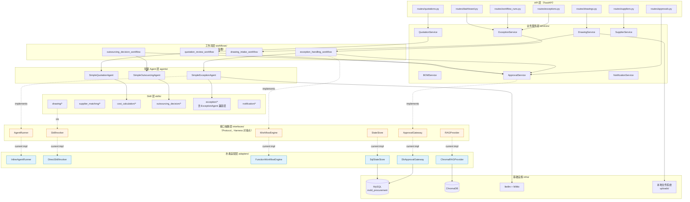
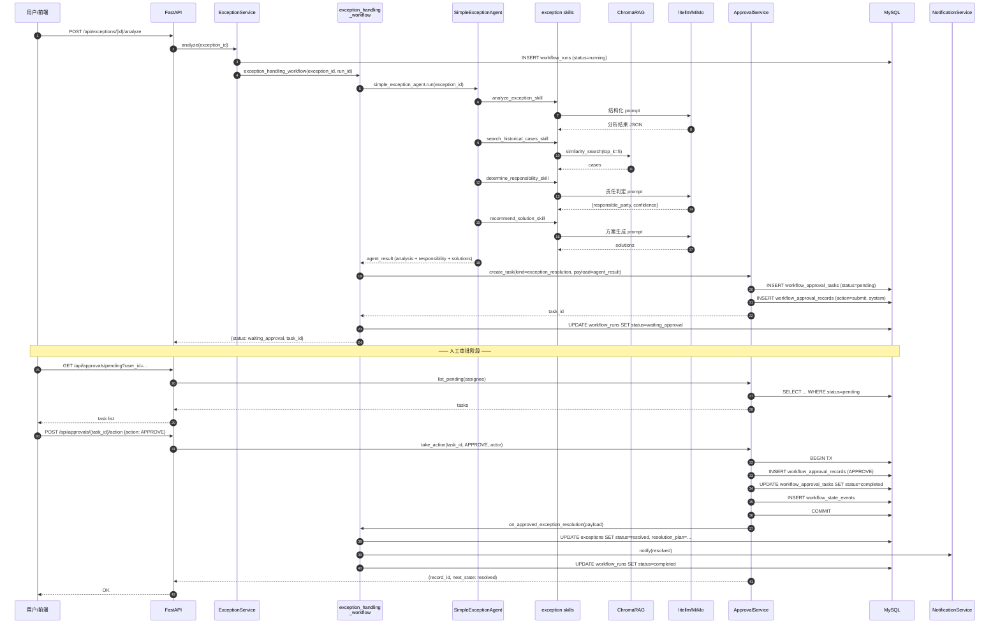
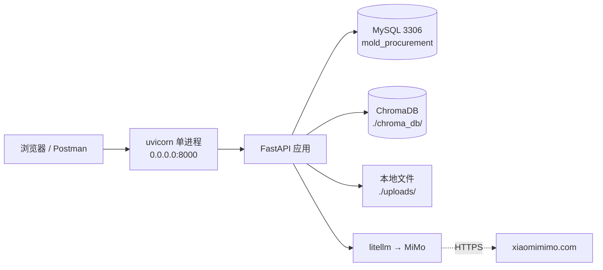

# Design Document: 模具委外采购系统 — 轻量脚本版 MVP

## Overview

本设计面向"2–3 周内交付可演示业务系统"的目标，采用**"脚本优先、框架滞后"**的务实路线：用 FastAPI + SQLAlchemy + 现有数据库，把异常分析、审批、图纸、BOM、报价、委外决策等核心业务以**直接 Python 函数 + 业务服务类**落地，不引入 DAG 工作流引擎、不引入 ReAct Agent 规划、不做事件总线和 WebSocket 推送。

与此同时，在所有"未来可能被 Harness 工作流引擎替换"的关键接口位置（Agent 执行、Skill 调度、工作流编排、审批网关、状态存储、RAG 检索）定义 `Protocol` **接口抽象层**，当前阶段用"朴素实现（Adapter）"满足业务，未来阶段可以**按接口逐个替换**为 Harness 版，业务代码零改动。

整个系统**复用**现有资产：`ExceptionAgent`（已完成的异常分析 Agent，直接当作一个 Skill 调用）、`ChromaDB`（RAG 向量库）、`litellm + MiMo`（LLM）、现有 `mold_procurement` MySQL 库（含 `exceptions / quotations / suppliers / human_review_tasks` 等业务表）、以及 migration 002 已创建的 `workflow_approval_records / workflow_approval_tasks / workflow_state_events` 三张审批表。

---

## 关键设计决策与 trade-off

### 决策 1：数据库继续用 MySQL（而不是迁移到 PostgreSQL）

用户原始需求提到"PostgreSQL 5432"但也说"或者继续用 MySQL 保持一致性（在设计中讨论）"。本设计**选择继续用 MySQL 3306**，理由：

| 维度 | MySQL（现状） | PostgreSQL（假设迁移） |
|------|---------------|----------------------|
| 改动量 | 零 | 重建 15+ 张表、改所有 SQL、重跑 migration |
| 风险 | 零 | 类型差异（JSON/BINARY/ON DUPLICATE KEY）、FK 语法差异 |
| `exceptions / quotations / suppliers` 现有数据 | 直接沿用 | 必须导出-导入 |
| `ExceptionAgent` 现有 `db_utils.py` | 直接沿用 | 必须改写 |
| 审批表（migration 002）| 已创建 | 重建 |
| MVP 交付周期 | 2-3 周 | 预计增加 3-5 天 |

**但在代码层做 DB 抽象**：`db/session.py` 只暴露 SQLAlchemy `Session`，不直接暴露 `pymysql`；业务代码不 import pymysql。这样**若未来真要迁 PG**，只需改 `create_engine("mysql+pymysql://...")` → `create_engine("postgresql+psycopg2://...")` 即可。

### 决策 2：Agent 用"按顺序调用 Skills 的类"，不走 ReAct 循环

现有 `ExceptionAgent` 继承自 Harness `AgentLoop`，内部走 LLM 规划 → 工具调用 → 结果解析的 ReAct 循环。这在业务语义简单、步骤固定的场景下**过度工程化**。MVP 版直接按以下模式：

```python
class SimpleExceptionAgent:
    async def run(self, exception_id: str) -> dict:
        exc = await self.repo.get_exception(exception_id)
        analysis = await analyze_exception_skill(exc)        # 固定 Step 1
        cases = await search_historical_cases_skill(exc)     # 固定 Step 2
        resp = await determine_responsibility_skill(analysis, cases)  # Step 3
        sol = await recommend_solution_skill(analysis, resp) # Step 4
        return {"analysis": analysis, "responsibility": resp, "solutions": sol}
```

**关键权衡**：
- ✅ 简单、可测试、结果可预期、延迟低（没有 LLM 规划开销）、Token 成本降低 60%+
- ✅ 已有 `ExceptionAgent` 继续**当作 Skill 保留**（仍可通过 HTTP 调用），但业务服务层走新的 `SimpleExceptionAgent`
- ⚠️ 损失"LLM 自主选择工具"的灵活性 —— 对委外采购这种**流程固定**的业务来说不是损失
- 🔁 未来切换：`SimpleExceptionAgent` 实现 `AgentRunner` Protocol；切 Harness 版时替换实现即可

### 决策 3：工作流 = Python 异步函数

不引入 DAG 引擎，不写 YAML，不需要拓扑排序与状态机。一个"工作流"就是一个 `async def xxx_workflow(...) -> dict` 函数，内部按业务步骤依次 `await` Skills 和 Services。

```python
async def exception_handling_workflow(exception_id: str) -> dict:
    # Step 1-4: agent 分析
    result = await simple_exception_agent.run(exception_id)
    # Step 5: 创建审批任务（同步返回 task_id，不阻塞）
    task_id = await approval_service.create_task(
        kind="exception_resolution",
        payload=result,
        assignees=[AssigneeSpec(type="role", identifier="QUALITY_MANAGER")],
    )
    # 当前状态：等待审批；后续由 /api/approvals/{id}/action 回调推进
    await workflow_run_repo.set_status(run_id, "waiting_approval")
    return {"status": "waiting_approval", "task_id": task_id}
```

**审批完成后的"后半程"**如何跑？有两种朴素实现：
- **方案 A（推荐）**：审批 API 回调里直接 `await execute_solution_after_approval(run_id, action)`，同进程异步执行后续步骤
- **方案 B**：在 `workflow_runs` 表里标记 `next_step`，后台轮询任务（`background_tick()`）每 10s 扫一次待推进的 run

MVP 先用方案 A（路径短、语义清晰、足够 demo）；方案 B 作为 P3 增强保留。

### 决策 4：审批用"状态 + 回调"而不用 `asyncio.Event` + WebSocket

- ✅ 审批表（`approval_tasks` / `approval_records`）沿用 migration 002 的 Harness 兼容结构
- ✅ 业务通过 **HTTP POST `/api/approvals/{task_id}/action`** 推进；回调里查 `task.kind` 决定调用哪个 `on_approved_*` 处理器
- ✅ 不依赖 WebSocket 实时推送；UI 通过轮询 `GET /api/approvals/pending` 与 `GET /api/workflow-runs/{id}` 查状态
- 🔁 未来 Harness 版：`ApprovalGateway.wait_for(task_id)` 用 `asyncio.Event` 实现"挂起-唤醒"；当前朴素实现只需在 `take_action()` 后调度 `on_approved_*` 即可

### 决策 5：审批动作 P0 只做 `APPROVE / REJECT`，其他动作在 P1 补全

需求文档要求 11+1 种审批动作。为缩短 P0 周期，采用**数据库 schema 全量 + 服务层分期实现**：

| 动作 | P0 | P1 | P2+ |
|------|----|----|-----|
| `APPROVE` | ✅ | | |
| `REJECT` | ✅ | | |
| `SAVE`（草稿）| | ✅ | |
| `SUBMIT`（提交）| | ✅ | |
| `WITHDRAW`（撤销）| | ✅ | |
| `RETRIEVE`（取回）| | ✅ | |
| `DELEGATE`（委托）| | ✅ | |
| `FORWARD`（直送）| | ✅ | |
| `REJECT_RETURN`（退回）| | ✅ | |
| `READ`（阅示）| | | ✅ |
| `ACK`（阅批）| | | ✅ |
| `CUSTOM` | | | ✅ |

Schema（`approval_records.action`）定义为 VARCHAR(32)，早已容纳所有动作值，P1/P2 无需迁移。

### 决策 6：接口抽象 = Python Protocol

用 `typing.Protocol`（PEP 544）定义六个对接点，**不用 ABC 基类**——Protocol 是结构化类型，避免强耦合继承关系。未来 Harness 实现类只要结构匹配就能替换，无需导入 interface。

---

## Architecture（High-Level Design）

### 整体架构图



### 核心模块划分

```
backend/
├── app/                         # FastAPI 应用入口
│   ├── main.py                  # 应用启动、路由挂载、lifespan
│   └── deps.py                  # 依赖注入（DB session、服务实例）
├── api/
│   └── routes/                  # 路由层（Pydantic + FastAPI）
│       ├── drawings.py          # 图纸上传/查询
│       ├── exceptions.py        # 异常 CRUD + 触发分析
│       ├── quotations.py        # 报价单
│       ├── approvals.py         # 审批 (pending/action/history)
│       ├── suppliers.py         # 供应商
│       ├── workflow_runs.py     # 工作流运行记录查询
│       └── dashboard.py         # 业务看板
├── services/                    # 业务服务层（取代传统 Agent 的"总控"）
│   ├── exception_service.py
│   ├── quotation_service.py
│   ├── drawing_service.py
│   ├── bom_service.py
│   ├── approval_service.py      # ⭐ 核心
│   ├── supplier_service.py
│   └── notification_service.py
├── agents/                      # 轻量 Agent —— 按序调用 Skills 的类
│   ├── simple_exception_agent.py
│   ├── simple_quotation_agent.py
│   └── simple_outsourcing_agent.py
├── skills/                      # 每个 Skill 一个函数/类
│   ├── drawing/                 # OCR/BOM/版本
│   ├── supplier_matching/
│   ├── cost_calculation/
│   ├── outsourcing_decision/
│   ├── exception/               # 复用 backend/ai_modules/skills/exception/
│   └── notification/
├── workflows/                   # 工作流 = Python 异步函数
│   ├── exception_handling.py
│   ├── quotation_review.py
│   ├── drawing_intake.py
│   └── outsourcing_decision.py
├── approvals/                   # 审批子系统
│   ├── actions.py               # 动作枚举、终态判定
│   ├── assignee.py              # 处理人解析
│   └── handlers.py              # on_approved_<kind> / on_rejected_<kind>
├── rag/                         # RAG 封装
│   ├── chroma_provider.py       # ChromaRAGProvider
│   └── prompts.py               # RAG 检索提示词模板
├── interfaces/                  # ⭐ Harness 对接点（Protocol）
│   ├── agent_runner.py
│   ├── skill_invoker.py
│   ├── workflow_engine.py
│   ├── approval_gateway.py
│   ├── state_store.py
│   └── rag_provider.py
├── adapters/                    # 当前朴素实现
│   ├── inline_agent_runner.py
│   ├── direct_skill_invoker.py
│   ├── function_workflow_engine.py
│   ├── db_approval_gateway.py
│   ├── sql_state_store.py
│   └── chroma_rag_provider.py
├── db/                          # 数据访问层
│   ├── session.py               # SQLAlchemy engine + Session
│   ├── models.py                # SQLAlchemy ORM 模型
│   └── repositories/            # 每张表一个 Repo
│       ├── drawing_repo.py
│       ├── bom_repo.py
│       ├── exception_repo.py
│       ├── quotation_repo.py
│       ├── supplier_repo.py
│       ├── approval_repo.py
│       ├── workflow_run_repo.py
│       └── notification_repo.py
├── migrations/                  # SQL 迁移脚本
│   └── 003_mvp_lightweight.sql
└── tests/
    ├── unit/
    ├── property/                # Hypothesis PBT
    └── e2e/
```

### 数据流图：异常分析 + 审批 + 执行（P0 核心流程）



### 部署架构



- **单进程单机**：`uvicorn app.main:app --host 0.0.0.0 --port 8000`
- **异步并发**：FastAPI + asyncio + SQLAlchemy 2.0 async
- **无 Redis、无 WebSocket、无 Celery**
- **租约互斥**：MVP 不做多进程；但 `workflow_runs.lease_owner` 字段预留，未来 Harness 版接管时可直接用

---

## Components and Interfaces（Low-Level Design）

### 接口抽象层（最关键 —— Harness 对接点）

六个 `Protocol` 定义了所有会被 Harness 替换的位置。业务代码**只依赖 Protocol**，不依赖具体实现。

#### 1. `AgentRunner` — Agent 执行接口

```python
# backend/interfaces/agent_runner.py
from typing import Protocol, Any
from dataclasses import dataclass

@dataclass
class AgentRunRequest:
    agent_key: str                      # "exception_agent" / "quotation_agent"
    inputs: dict[str, Any]
    context: dict[str, Any] | None = None

@dataclass
class AgentRunResult:
    success: bool
    outputs: dict[str, Any]
    steps: list[dict[str, Any]]         # 每个 Skill 调用的 snapshot
    error: str | None = None
    duration_ms: int = 0

class AgentRunner(Protocol):
    """Agent 执行接口。"""
    async def run(self, request: AgentRunRequest) -> AgentRunResult: ...
```

**当前朴素实现**（`adapters/inline_agent_runner.py`）：按 `agent_key` 路由到 `SimpleExceptionAgent / SimpleQuotationAgent` 实例，同进程调用。

**未来 Harness 实现**：通过 `Orchestrator.route(agent_key).run(...)` 走 `AgentLoop` ReAct 循环。

| 朴素版 | Harness 版 |
|--------|-----------|
| 固定 Skill 调用顺序 | LLM 自主规划 |
| 无 ReAct、无 tool-use 协议 | 完整 ReAct + 工具注册 |
| 2–3 秒/次 | 10–30 秒/次（多轮 LLM）|

#### 2. `SkillInvoker` — Skill 调用接口

```python
# backend/interfaces/skill_invoker.py
from typing import Protocol, Any, Callable, Awaitable

SkillFn = Callable[..., Awaitable[dict[str, Any]]]

class SkillInvoker(Protocol):
    def register(self, name: str, fn: SkillFn) -> None: ...
    async def invoke(self, name: str, **kwargs) -> dict[str, Any]: ...
    def list_skills(self) -> list[str]: ...
```

**当前朴素实现**（`adapters/direct_skill_invoker.py`）：内存 dict 注册 + 直接 `await fn(**kwargs)`。

**未来 Harness 实现**：代理到 `harness.tools.ToolRegistry.execute(name, args)`，享受权限审计 / 超时 / 重试。

#### 3. `WorkflowEngine` — 工作流编排接口

```python
# backend/interfaces/workflow_engine.py
from typing import Protocol, Any
from uuid import UUID

class WorkflowEngine(Protocol):
    async def start(
        self,
        workflow_key: str,
        inputs: dict[str, Any],
        *,
        trigger_user: str | None = None,
    ) -> UUID: ...

    async def resume(self, run_id: UUID, payload: dict[str, Any]) -> None:
        """当外部事件（审批完成）到来时推进后续步骤。"""

    async def get_status(self, run_id: UUID) -> dict[str, Any]: ...
```

**当前朴素实现**（`adapters/function_workflow_engine.py`）：
- `start()` → 在 `workflow_runs` 写一行，查 `WORKFLOW_REGISTRY[workflow_key]` 拿到 Python 函数，直接 `await fn(inputs, run_id=...)`
- `resume()` → 查 `workflow_runs.next_step`，调用对应的 `on_approved_*` 处理器

**未来 Harness 实现**：调用 `harness.workflow.WorkflowEngine.start(key, inputs)` 触发 DAG 调度。

#### 4. `ApprovalGateway` — 审批网关接口

```python
# backend/interfaces/approval_gateway.py
from typing import Protocol, Any
from uuid import UUID
from enum import Enum

class AssigneeType(str, Enum):
    USER = "user"
    SHARED_ACCOUNT = "shared_account"
    ROLE = "role"

class ApprovalAction(str, Enum):
    SAVE = "save"
    SUBMIT = "submit"
    RETRIEVE = "retrieve"
    APPROVE = "approve"
    REJECT_RETURN = "reject_return"
    REJECT = "reject"
    WITHDRAW = "withdraw"
    READ = "read"
    ACK = "ack"
    DELEGATE = "delegate"
    FORWARD = "forward"
    CUSTOM = "custom"

    @classmethod
    def terminal(cls) -> set["ApprovalAction"]:
        return {cls.APPROVE, cls.REJECT, cls.REJECT_RETURN, cls.WITHDRAW}

class AssigneeSpec:
    type: AssigneeType
    identifier: str
    display_name: str | None

class ApprovalGateway(Protocol):
    async def create_task(
        self,
        kind: str,
        payload: dict[str, Any],
        assignees: list[AssigneeSpec],
        *,
        run_id: UUID | None = None,
        due_at: "datetime | None" = None,
    ) -> UUID: ...

    async def take_action(
        self,
        task_id: UUID,
        action: ApprovalAction,
        actor_id: str,
        *,
        comment: str | None = None,
        delegate_to: str | None = None,
    ) -> dict[str, Any]: ...

    async def list_pending(
        self,
        assignee_type: AssigneeType,
        assignee_id: str,
        *,
        page: int = 1,
        page_size: int = 50,
    ) -> list[dict[str, Any]]: ...

    async def get_history(self, task_id: UUID) -> list[dict[str, Any]]: ...
```

**当前朴素实现**（`adapters/db_approval_gateway.py`）：直接读写 `workflow_approval_tasks / _records / _state_events` 三表；`take_action` 成功后在同一个进程里调度 `on_approved_{kind}` 回调。

**未来 Harness 实现**：调用 `ApprovalManager.take_action()`，内部走 `asyncio.Event` 唤醒被挂起的工作流协程。数据库表结构完全一致（SQL 级零改动）。

#### 5. `StateStore` — 状态存储接口

```python
# backend/interfaces/state_store.py
from typing import Protocol, Any
from uuid import UUID

class StateStore(Protocol):
    async def put(self, run_id: UUID, key: str, value: Any) -> None: ...
    async def get(self, run_id: UUID, key: str) -> Any: ...
    async def snapshot(self, run_id: UUID) -> dict[str, Any]: ...
```

**当前朴素实现**：读写 `workflow_runs.context_json`（JSON 列）。

**未来 Harness 实现**：写入 `workflow_instances.context_json`，支持大 context 的增量 diff。

#### 6. `RAGProvider` — RAG 检索接口

```python
# backend/interfaces/rag_provider.py
from typing import Protocol, Any

class RAGProvider(Protocol):
    async def upsert(
        self, collection: str, ids: list[str], documents: list[str],
        metadatas: list[dict[str, Any]] | None = None,
    ) -> None: ...

    async def similarity_search(
        self, collection: str, query: str, *, top_k: int = 5,
        filter: dict[str, Any] | None = None,
    ) -> list[dict[str, Any]]: ...

    async def delete(self, collection: str, ids: list[str]) -> None: ...
```

**当前朴素实现**（`adapters/chroma_rag_provider.py`）：调用 ChromaDB Python client。

**未来 Harness 实现**：可能改走统一的 Knowledge Base 服务（支持多向量库、租户隔离）。

### 接口-实现对比表（升级路径）

| Protocol | 当前朴素实现 | 复杂度 | Harness 版替换点 | 替换成本 |
|----------|-------------|--------|------------------|----------|
| `AgentRunner` | `InlineAgentRunner` → `SimpleXxxAgent` | ~50 LOC | `HarnessAgentRunner` → `AgentLoop` | 中 |
| `SkillInvoker` | `DirectSkillInvoker`（dict）| ~30 LOC | `ToolRegistryInvoker` | 低 |
| `WorkflowEngine` | `FunctionWorkflowEngine`（dict → async fn）| ~80 LOC | `HarnessWorkflowEngine` → DAG 执行 | 高（需要改 workflow 定义为 YAML） |
| `ApprovalGateway` | `DbApprovalGateway`（直接 SQL）| ~150 LOC | `HarnessApprovalGateway` → `ApprovalManager` | **低**（schema 相同）|
| `StateStore` | `SqlStateStore`（JSON 列） | ~40 LOC | `HarnessStateStore` → `WorkflowContext` | 低 |
| `RAGProvider` | `ChromaRAGProvider` | ~60 LOC | 保持不变或切换 | 零 |

---

## Data Models

### 数据模型总览（10 张表）

| 表 | 来源 | 作用 |
|----|------|------|
| `drawings` | **新建** | 图纸元数据 + 文件路径 + 版本 |
| `boms` | **新建** | 物料清单（支持版本叠加） |
| `exceptions` | 复用 `init.sql` | 异常 |
| `quotations` | 复用 `init.sql` | 报价 |
| `suppliers` | 复用 `init.sql` | 供应商 |
| `workflow_approval_tasks` | 复用 migration 002 | 审批任务（待办） |
| `workflow_approval_records` | 复用 migration 002 | 审批历史（只追加） |
| `workflow_state_events` | 复用 migration 002 | 状态事件（审计） |
| `ai_analyses` | **新建** | 通用 AI 分析结果（异常/报价通用） |
| `workflow_runs` | **新建** | 轻量工作流运行记录（未来升级为 `workflow_instances`） |
| `notifications` | **新建** | 通知（邮件/站内信） |

### 新建表 DDL（`migrations/003_mvp_lightweight.sql`）

```sql
-- 图纸表
CREATE TABLE IF NOT EXISTS drawings (
    id VARCHAR(36) PRIMARY KEY,
    project_id VARCHAR(36),
    part_id VARCHAR(36),
    file_name VARCHAR(255) NOT NULL,
    file_path VARCHAR(512) NOT NULL,              -- 本地 uploads/... 路径
    file_format VARCHAR(16) NOT NULL,             -- pdf/dwg/step/pdf
    version INT NOT NULL DEFAULT 1,
    parent_drawing_id VARCHAR(36),                -- 父版本（用于版本叠加）
    ocr_status VARCHAR(32) DEFAULT 'pending',     -- pending/done/failed
    ocr_text LONGTEXT,
    extracted_meta JSON,                          -- 工序/材料/BOM 摘要
    uploaded_by VARCHAR(36),
    uploaded_at TIMESTAMP DEFAULT CURRENT_TIMESTAMP,
    created_at TIMESTAMP DEFAULT CURRENT_TIMESTAMP,
    updated_at TIMESTAMP DEFAULT CURRENT_TIMESTAMP ON UPDATE CURRENT_TIMESTAMP,
    INDEX idx_project (project_id),
    INDEX idx_part (part_id),
    INDEX idx_parent (parent_drawing_id)
) ENGINE=InnoDB DEFAULT CHARSET=utf8mb4;

-- BOM 表（支持版本叠加）
CREATE TABLE IF NOT EXISTS boms (
    id VARCHAR(36) PRIMARY KEY,
    drawing_id VARCHAR(36) NOT NULL,
    bom_type VARCHAR(32) NOT NULL,                -- raw_material/hardware/cost_sheet
    version INT NOT NULL DEFAULT 1,
    items_json JSON NOT NULL,                     -- [{material, qty, unit, spec}, ...]
    parent_bom_id VARCHAR(36),                    -- 上一版 BOM（用于 diff）
    diff_json JSON,                               -- 与父版本的差异
    status VARCHAR(32) NOT NULL DEFAULT 'active', -- active/superseded
    created_at TIMESTAMP DEFAULT CURRENT_TIMESTAMP,
    updated_at TIMESTAMP DEFAULT CURRENT_TIMESTAMP ON UPDATE CURRENT_TIMESTAMP,
    INDEX idx_drawing (drawing_id),
    INDEX idx_parent (parent_bom_id),
    INDEX idx_type_status (bom_type, status)
) ENGINE=InnoDB DEFAULT CHARSET=utf8mb4;

-- 通用 AI 分析结果
CREATE TABLE IF NOT EXISTS ai_analyses (
    id VARCHAR(36) PRIMARY KEY,
    subject_type VARCHAR(32) NOT NULL,            -- exception/quotation/drawing/outsourcing
    subject_id VARCHAR(36) NOT NULL,
    agent_key VARCHAR(64) NOT NULL,               -- simple_exception_agent / ...
    result_json JSON NOT NULL,
    steps_json JSON,                              -- Skill 调用链 snapshot
    model_name VARCHAR(64),
    duration_ms INT,
    status VARCHAR(32) NOT NULL,                  -- success/failed/timeout
    error_message TEXT,
    created_at TIMESTAMP DEFAULT CURRENT_TIMESTAMP,
    INDEX idx_subject (subject_type, subject_id),
    INDEX idx_agent (agent_key, created_at)
) ENGINE=InnoDB DEFAULT CHARSET=utf8mb4;

-- 轻量工作流运行（未来可迁移为 workflow_instances）
CREATE TABLE IF NOT EXISTS workflow_runs (
    id BINARY(16) PRIMARY KEY,                    -- UUID（与未来 workflow_instances 同结构）
    workflow_key VARCHAR(128) NOT NULL,
    version INT NOT NULL DEFAULT 1,
    status VARCHAR(32) NOT NULL,                  -- pending/running/waiting_approval/completed/failed/cancelled
    inputs_json JSON,
    outputs_json JSON,
    context_json JSON,
    current_step VARCHAR(128),                    -- 脚本版的"当前步骤名"
    next_step VARCHAR(128),                       -- 审批完成后的下一个要执行的步骤
    trigger_source VARCHAR(64),
    trigger_user VARCHAR(128),
    lease_owner VARCHAR(128),                     -- 预留：多进程场景
    lease_expires_at DATETIME,
    error_message TEXT,
    started_at DATETIME NOT NULL,
    ended_at DATETIME,
    created_at TIMESTAMP DEFAULT CURRENT_TIMESTAMP,
    updated_at TIMESTAMP DEFAULT CURRENT_TIMESTAMP ON UPDATE CURRENT_TIMESTAMP,
    INDEX idx_key_status (workflow_key, status),
    INDEX idx_status (status),
    INDEX idx_lease (lease_owner, lease_expires_at)
) ENGINE=InnoDB DEFAULT CHARSET=utf8mb4;

-- 通知表
CREATE TABLE IF NOT EXISTS notifications (
    id VARCHAR(36) PRIMARY KEY,
    channel VARCHAR(32) NOT NULL,                 -- email/in_app/sms
    recipient VARCHAR(255) NOT NULL,
    subject VARCHAR(255),
    body TEXT NOT NULL,
    related_subject_type VARCHAR(32),             -- exception/approval/...
    related_subject_id VARCHAR(36),
    status VARCHAR(32) NOT NULL DEFAULT 'pending',-- pending/sent/failed
    retry_count INT NOT NULL DEFAULT 0,
    last_error TEXT,
    sent_at DATETIME,
    created_at TIMESTAMP DEFAULT CURRENT_TIMESTAMP,
    INDEX idx_status_created (status, created_at),
    INDEX idx_recipient (recipient)
) ENGINE=InnoDB DEFAULT CHARSET=utf8mb4;
```

### 审批相关表（已存在于 migration 002，无需修改）

`workflow_approval_tasks / workflow_approval_records / workflow_state_events` 直接沿用 migration 002 的 Harness 兼容设计，schema 不变。审批任务新增 `kind` 字段（VARCHAR(32)）用于路由到业务处理器；MVP 先复用 `node_id` 字段承载该语义，P1 再单独加列。

### 关键验证规则

- `workflow_approval_records` 只 INSERT，禁止 UPDATE/DELETE（应用层 + 未来 DB 触发器）
- `approval_tasks.status` 初始 `pending`，终态 `completed / withdrawn / timeout`
- `workflow_runs.status` 状态机：`pending → running → {waiting_approval ↔ running} → {completed, failed, cancelled}`
- BOM 版本叠加：新 BOM 的 `parent_bom_id` 必须存在且 `status='active'`；INSERT 新版本的同时 UPDATE 父版本 `status='superseded'`（单事务）
- `drawings.version` 与 `parent_drawing_id` 同步维护：每次上传新版本 `version = parent.version + 1`

---

## Key Classes / Functions with Formal Specifications

### 1. `SimpleAgent` 基类

```python
# backend/agents/base.py
from abc import ABC, abstractmethod
from typing import Any
import time

class SimpleAgent(ABC):
    """轻量 Agent 基类：按序调用 Skills，不走 LLM 规划。"""
    agent_key: str

    def __init__(self, skill_invoker: SkillInvoker, rag: RAGProvider):
        self.skills = skill_invoker
        self.rag = rag
        self.steps: list[dict[str, Any]] = []

    async def _call_skill(self, name: str, **kwargs) -> dict:
        """
        前置条件：name ∈ self.skills.list_skills()
        后置条件：
          - 如果成功，返回 dict，且 self.steps 追加一条 {skill, inputs, output, duration_ms, status: "ok"}
          - 如果失败，self.steps 追加 {status: "failed", error}，并向上抛异常
        """
        t0 = time.monotonic()
        try:
            out = await self.skills.invoke(name, **kwargs)
            self.steps.append({
                "skill": name, "inputs": kwargs, "output": out,
                "duration_ms": int((time.monotonic() - t0) * 1000),
                "status": "ok",
            })
            return out
        except Exception as e:
            self.steps.append({
                "skill": name, "inputs": kwargs, "error": str(e),
                "duration_ms": int((time.monotonic() - t0) * 1000),
                "status": "failed",
            })
            raise

    @abstractmethod
    async def run(self, *args, **kwargs) -> dict[str, Any]:
        """具体 Agent 实现业务流程。"""
```

### 2. `SimpleExceptionAgent`

```python
# backend/agents/simple_exception_agent.py
class SimpleExceptionAgent(SimpleAgent):
    agent_key = "simple_exception_agent"

    async def run(self, exception_id: str) -> dict[str, Any]:
        """
        前置条件：
          - exception_id 在 exceptions 表存在
          - self.skills 已注册 analyze_exception / search_cases /
            determine_responsibility / recommend_solution
        后置条件：
          - 返回 {"analysis", "historical_cases", "responsibility", "solutions", "steps"}
          - self.steps 长度 == 4（每个 Skill 一条）
          - 任一 Skill 失败 → 向上抛异常，由 workflow 层捕获并写入 workflow_runs.status=failed
        """
        analysis = await self._call_skill("analyze_exception", exception_id=exception_id)
        cases = await self._call_skill(
            "search_historical_cases",
            query=analysis["exception_type"], top_k=5,
        )
        resp = await self._call_skill(
            "determine_responsibility",
            analysis=analysis, historical_cases=cases,
        )
        sols = await self._call_skill(
            "recommend_solution",
            analysis=analysis, responsibility=resp,
        )
        return {
            "analysis": analysis,
            "historical_cases": cases,
            "responsibility": resp,
            "solutions": sols,
            "steps": self.steps,
        }
```

### 3. `ApprovalService`

```python
# backend/services/approval_service.py
class ApprovalService:
    """审批核心服务。实现 ApprovalGateway Protocol。"""

    def __init__(
        self,
        session_factory,
        workflow_engine: WorkflowEngine,
        handlers: dict[str, Callable],   # kind → handler
    ):
        self._sf = session_factory
        self._engine = workflow_engine
        self._handlers = handlers   # {"exception_resolution": on_approved_exception, ...}

    async def create_task(
        self, kind: str, payload: dict, assignees: list[AssigneeSpec],
        *, run_id: UUID | None = None, due_at: datetime | None = None,
    ) -> UUID:
        """
        前置条件：
          - len(assignees) >= 1
          - kind ∈ self._handlers.keys()
        后置条件：
          - workflow_approval_tasks 新增 len(assignees) 行（每个 assignee 一行），status='pending'
          - workflow_approval_records 新增 1 行，action='submit'，actor='system'
          - workflow_state_events 新增 1 行，event_type='approval_task_created'
          - 全部写入在同一个 DB 事务内
        """
        ...

    async def take_action(
        self, task_id: UUID, action: ApprovalAction, actor_id: str,
        *, comment: str | None = None, delegate_to: str | None = None,
    ) -> dict:
        """
        前置条件：
          - task_id 存在且 status='pending' 或 'claimed'
          - actor_id 在 task.assignee 解析后的用户集合内
          - action ∈ allowed_actions[task.kind]
        后置条件：
          - 插入 workflow_approval_records (动作记录)
          - 如果 action ∈ terminal：UPDATE tasks SET status='completed'
          - 如果 action = APPROVE：调度 self._handlers[task.kind](payload, approved=True)
          - 如果 action = REJECT：调度 self._handlers[task.kind](payload, approved=False)
          - 如果 action = DELEGATE/FORWARD：新建一个指向 delegate_to 的 task
          - 单事务提交；任一失败整体回滚
        历史只追加（P7 属性）：不修改已有的 approval_records 行
        """
        ...

    async def list_pending(
        self, assignee_type: AssigneeType, assignee_id: str,
        *, page: int = 1, page_size: int = 50,
    ) -> list[dict]:
        """查询处理人的 pending 任务。使用索引 idx_assignee_pending 加速。"""
        ...

    async def get_history(self, task_id: UUID) -> list[dict]:
        """返回审批历史（按 created_at 升序），包含委托链。"""
        ...
```

### 4. `FunctionWorkflowEngine`

```python
# backend/adapters/function_workflow_engine.py
WORKFLOW_REGISTRY: dict[str, Callable] = {}

def register_workflow(key: str):
    def deco(fn):
        WORKFLOW_REGISTRY[key] = fn
        return fn
    return deco

class FunctionWorkflowEngine:
    """朴素工作流引擎：一个 workflow = 一个 async 函数。"""

    def __init__(self, session_factory, state_store: StateStore):
        self._sf = session_factory
        self._state = state_store

    async def start(
        self, workflow_key: str, inputs: dict, *,
        trigger_user: str | None = None,
    ) -> UUID:
        """
        前置条件：
          - workflow_key ∈ WORKFLOW_REGISTRY
          - inputs 是合法 JSON-serializable dict
        后置条件：
          - workflow_runs 新增一行，status='running'
          - 异步调度对应函数（不阻塞调用方；当前实现为 await 直到函数返回或 yield 到 waiting_approval）
          - 返回 run_id (UUID)
        """
        run_id = uuid4()
        fn = WORKFLOW_REGISTRY[workflow_key]
        # 写 DB
        async with self._sf() as s:
            s.add(WorkflowRunORM(
                id=run_id.bytes, workflow_key=workflow_key, version=1,
                status="running", inputs_json=json.dumps(inputs),
                trigger_user=trigger_user, started_at=datetime.utcnow(),
            ))
            await s.commit()
        # 执行（当前朴素：直接 await；函数内部遇到审批会主动写 status=waiting_approval 并 return）
        try:
            result = await fn(inputs=inputs, run_id=run_id)
            # 若函数返回 waiting_approval 状态，保持；否则标记 completed
            if result.get("status") != "waiting_approval":
                await self._finalize(run_id, "completed", outputs=result)
        except Exception as e:
            await self._finalize(run_id, "failed", error=str(e))
            raise
        return run_id

    async def resume(self, run_id: UUID, payload: dict) -> None:
        """审批完成后的续跑。payload 包含 {kind, approved, record_id, ...}"""
        run = await self._load(run_id)
        next_step = run.next_step
        fn = RESUME_REGISTRY[next_step]     # 在 handlers.py 中注册
        await fn(run_id=run_id, payload=payload)

    async def get_status(self, run_id: UUID) -> dict:
        ...
```

### 5. Skill 函数签名

所有 Skill 统一签名：`async def xxx_skill(**kwargs) -> dict[str, Any]`

```python
# backend/skills/drawing/ocr.py
async def ocr_drawing_skill(file_path: str) -> dict:
    """
    前置：file_path 指向本地可读文件
    后置：返回 {"text": str, "confidence": float, "page_count": int}
    """

# backend/skills/drawing/bom_extraction.py
async def extract_bom_skill(ocr_text: str, drawing_id: str) -> dict:
    """
    前置：ocr_text 非空
    后置：返回 {"raw_material": [...], "hardware": [...], "cost_sheet": [...]}
          每项 {material, qty, unit, spec}
    """

# backend/skills/drawing/bom_merge.py
async def merge_bom_version_skill(
    parent_bom_id: str, new_items: list[dict],
) -> dict:
    """
    前置：parent_bom_id 对应 BOM 存在且 status='active'
    后置：
      - 新 BOM items = merge(parent.items, new_items) （按 material+spec 去重叠加）
      - 返回 {"new_bom_id": str, "diff": {"added": [...], "changed": [...], "removed": [...]}}
      - 旧 BOM status 置为 'superseded'（单事务）
    幂等：相同 parent + 相同 new_items 多次调用产生相同 diff（P6 属性）
    """

# backend/skills/supplier_matching/match.py
async def match_supplier_skill(
    process_types: list[str], region: str | None = None, top_k: int = 10,
) -> dict:
    """
    后置：返回 {"suppliers": [{supplier_id, name, score, match_reasons}, ...]}
    score = weighted(capability_match, historical_rating, region_affinity)
    """

# backend/skills/cost_calculation/cost.py
async def read_external_cost_skill(
    material: str, process: str, qty: int,
) -> dict:
    """
    读取外部成本核算模块的数据（MVP：读 cost_library 表；未来接 HTTP API）
    后置：返回 {"material_cost": float, "process_cost": float, "source": "external"}
    """

async def read_logistics_cost_skill(
    from_region: str, to_region: str, weight_kg: float,
) -> dict:
    """
    读取物流模块历史数据（MVP：读 logistics_history 表；P3 补充手工记录表单）
    后置：返回 {"logistics_cost": float, "source": "history_avg"}
    """

async def total_cost_estimate_skill(
    material: str, process: str, qty: int,
    from_region: str, to_region: str, weight_kg: float,
) -> dict:
    """
    组合上面两个 Skill 得出总成本。
    后置：返回 {"material_cost", "process_cost", "logistics_cost", "total"}
    """

# backend/skills/outsourcing_decision/decide.py
async def decide_outsourcing_skill(
    part_info: dict, process_list: list[str], supplier_capacity: dict,
) -> dict:
    """
    决策规则（按优先级）：
      1. 如果 process ∈ {'热处理', '表面处理'} → 强制 MUST_OUTSOURCE
      2. 如果所有 process ∈ supplier_capacity.internal → PREFER_INTERNAL
      3. 否则逐工序判定：工序级 / 零件级 / 全套
    后置：返回 {"decision": "outsource_all|outsource_by_process|internal",
                 "reason": str, "forced_outsource_processes": [...]}
    """

# backend/skills/exception/*（复用现有 backend/ai_modules/skills/exception/）
# 在 backend/skills/exception/__init__.py 中做适配：
#   async def analyze_exception_skill(**kwargs) -> dict:
#       return await _existing_analyze_exception.execute(**kwargs)

# backend/skills/notification/send.py
async def send_notification_skill(
    channel: str, recipient: str, subject: str, body: str,
    related_subject_type: str | None = None,
    related_subject_id: str | None = None,
) -> dict:
    """
    后置：
      - notifications 表新增一行，status='pending'
      - 尝试投递（SMTP / 内部 WS）
      - 成功：UPDATE status='sent', sent_at=now
      - 失败：UPDATE retry_count += 1，status='pending'（允许后台重试）
    至少一次保证：同一 subject_id + channel 至少被成功发送一次（由后台重试任务保证，P10 属性）
    """
```

---

## 典型业务流程伪代码（异常分析 + 审批）

```python
# backend/workflows/exception_handling.py
from backend.adapters.function_workflow_engine import register_workflow, RESUME_REGISTRY

@register_workflow("exception_handling_v1")
async def exception_handling_workflow(
    inputs: dict, run_id: UUID,
) -> dict:
    """
    P0 核心流程：异常分析 → 生成方案 → 创建审批任务（挂起）
    """
    exception_id = inputs["exception_id"]

    # Step 1-4: Agent 走一轮分析
    agent = get_agent("simple_exception_agent")
    agent_result = await agent.run(exception_id=exception_id)

    # 持久化 AI 分析到 ai_analyses 表
    await ai_analysis_repo.save(
        subject_type="exception", subject_id=exception_id,
        agent_key=agent.agent_key, result=agent_result,
        steps=agent_result["steps"],
    )

    # Step 5: 创建审批任务（同步返回，不阻塞）
    task_id = await approval_service.create_task(
        kind="exception_resolution",
        payload={
            "exception_id": exception_id,
            "analysis": agent_result["analysis"],
            "solutions": agent_result["solutions"],
            "responsibility": agent_result["responsibility"],
        },
        assignees=[
            AssigneeSpec(type=AssigneeType.ROLE, identifier="QUALITY_MANAGER"),
        ],
        run_id=run_id,
    )

    # 标记 run 进入 waiting_approval，告诉下一步去哪
    await workflow_run_repo.update_status(
        run_id, status="waiting_approval",
        next_step="on_approved_exception_resolution",
    )

    return {"status": "waiting_approval", "task_id": str(task_id)}


# 注册"审批通过/拒绝后的续跑"
async def on_approved_exception_resolution(run_id: UUID, payload: dict):
    """
    approved=True  → 执行方案、更新 exception 状态、通知
    approved=False → 标记 exception 暂缓处理
    """
    exception_id = payload["exception_id"]
    if payload["approved"]:
        solution = payload.get("selected_solution") or payload["solutions"][0]
        await exception_repo.update(
            exception_id,
            status="resolved",
            resolution_plan=solution["description"],
            responsible_party=payload["responsibility"]["responsible_party"],
        )
        await notification_service.notify(
            recipient=payload.get("reporter_email") or "default@corp.com",
            subject=f"异常 {exception_id} 已解决",
            body=f"方案：{solution['description']}",
            related_subject_type="exception",
            related_subject_id=exception_id,
        )
    else:
        await exception_repo.update(exception_id, status="on_hold")

    await workflow_run_repo.update_status(
        run_id, status="completed",
        outputs={"final_state": "resolved" if payload["approved"] else "on_hold"},
    )

RESUME_REGISTRY["on_approved_exception_resolution"] = on_approved_exception_resolution
```

---

## API Routes（P0 + P1）

| Method | Path | 用途 | 优先级 |
|--------|------|------|--------|
| POST | `/api/exceptions/{id}/analyze` | 触发异常分析工作流 | P0 |
| GET | `/api/exceptions/{id}` | 查询异常详情（含最新分析）| P0 |
| GET | `/api/exceptions` | 异常列表（过滤、分页）| P0 |
| POST | `/api/approvals/{task_id}/action` | 执行审批动作 | P0 |
| GET | `/api/approvals/pending` | 我的待办（按 assignee）| P0 |
| GET | `/api/approvals/{task_id}` | 单个审批任务详情 | P0 |
| GET | `/api/approvals/{task_id}/history` | 审批历史链 | P0 |
| GET | `/api/workflow-runs/{run_id}` | 查询工作流运行状态 | P0 |
| POST | `/api/quotations/{id}/analyze` | 触发报价分析工作流 | P1 |
| GET | `/api/quotations` | 报价列表 | P1 |
| GET | `/api/suppliers/match` | 供应商匹配（按工序/地区）| P1 |
| POST | `/api/notifications/send` | 手动触发通知（测试用）| P1 |
| POST | `/api/drawings` | 图纸上传（multipart/form-data）| P2 |
| GET | `/api/drawings/{id}` | 图纸详情 + OCR 结果 | P2 |
| GET | `/api/drawings/{id}/bom` | 图纸 BOM | P2 |
| POST | `/api/boms/{parent_id}/merge` | BOM 版本叠加 | P2 |
| POST | `/api/outsourcing-decision` | 委外决策 | P2 |
| GET | `/dashboard` | 业务看板 HTML | P0 |

### 关键 API Request/Response 示例

```python
# POST /api/exceptions/{id}/analyze
# Response: 202 Accepted
{
  "run_id": "b3c...",
  "status": "running",
  "poll_url": "/api/workflow-runs/b3c..."
}

# POST /api/approvals/{task_id}/action
# Request
{
  "action": "approve",                       # or "reject" / 其他（P1+）
  "actor_id": "user-004",
  "comment": "方案可行，同意执行",
  "selected_solution": { "solution_type": "rework", ... }   # APPROVE 时可选
}
# Response
{
  "record_id": "a1b...",
  "task_status": "completed",
  "next_action": "execute_solution"
}
```

---

## Correctness Properties（面向 PBT）

下列属性用 Hypothesis 落成单元/property 测试（`backend/tests/property/`）。P0 必须覆盖 P1–P5；P1 覆盖 P6–P10。

### P1. 审批动作权限

```python
# 只有任务的 assignees（解析后实际用户集）内的 actor 能执行动作
forall task, actor, action:
    if actor not in resolve_assignees(task.assignees):
        take_action(task.id, action, actor) raises PermissionError
```

### P2. 审批历史只追加

```python
# take_action 前后，workflow_approval_records 的旧行内容不变
forall record_row in approval_records before take_action:
    approval_records after take_action contains record_row (unchanged)
    AND |approval_records after| >= |approval_records before| + 1
```

### P3. 审批节点必达终态

```python
# 对任何 pending 任务，执行一次终态动作或超时后，status 必定 ∈ {completed, timeout, withdrawn}
forall task with status='pending':
    exists some action ∈ {APPROVE, REJECT, REJECT_RETURN, WITHDRAW, TIMEOUT}:
        task.status after action ∈ {completed, timeout, withdrawn}
```

### P4. workflow_runs 状态转换合法性

```python
VALID_TRANSITIONS = {
    'pending': {'running', 'cancelled'},
    'running': {'waiting_approval', 'completed', 'failed', 'cancelled'},
    'waiting_approval': {'running', 'completed', 'failed', 'cancelled'},
    'completed': set(),    # 终态
    'failed': set(),
    'cancelled': set(),
}
forall run, new_status:
    update_status(run, new_status) succeeds
    <=> new_status ∈ VALID_TRANSITIONS[run.status]
```

### P5. 工作流 run 幂等启动

```python
# 相同 inputs 启动两次 → 返回两个不同 run_id，但输出语义等价（当被标注为 idempotent=True）
forall inputs, workflow_key:
    run1 = start(workflow_key, inputs)
    run2 = start(workflow_key, inputs)
    run1 != run2 AND outputs(run1) == outputs(run2) (modulo timestamps)
```

### P6. BOM 版本叠加一致性

```python
# 合并父 BOM 与新条目后的总项数 = 父项数 + 新增项数 - 重复项数
forall parent_items, new_items:
    merged = merge_bom(parent_items, new_items)
    |merged| == |parent_items| + |new_items - duplicates(parent_items, new_items)|
    AND diff.added + diff.removed + diff.changed == symmetric_diff(parent, merged)
```

### P7. Skill 幂等性（标注为幂等的 Skill）

```python
# 对所有标注 @idempotent 的 Skill，相同输入多次调用返回相同输出
forall skill in IDEMPOTENT_SKILLS, kwargs:
    invoke(skill, **kwargs) == invoke(skill, **kwargs)  # modulo trace metadata
```

### P8. 上下文 round-trip

```python
# workflow_runs.context_json 序列化后反序列化应等于原对象
forall context:
    parse(serialize(context)) == context
```

### P9. 决策确定性（委外决策 Skill）

```python
# 相同输入必须得到相同决策（该 Skill 不依赖随机/时间）
forall part_info, process_list, capacity:
    decide(part, procs, cap) == decide(part, procs, cap)
```

### P10. 通知至少一次投递

```python
# 标记为 pending 的通知，经过有限次重试后必达 sent 或最终失败标记
forall notif with status='pending':
    after sufficient retry cycles:
        notif.status ∈ {'sent', 'permanently_failed'}
    AND if notif.status == 'sent': exists at least one successful deliver call
```

### P11. 审批委托链追踪

```python
# 一条审批链（APPROVE 前可能经过 N 次 DELEGATE/FORWARD）可完整重建
forall terminal_record (APPROVE/REJECT):
    chain = get_history(terminal_record.task_id)
    chain starts with SUBMIT, ends with terminal_record
    every DELEGATE/FORWARD has matching delegate_to link to next record's actor
```

### 测试库与执行

```python
# backend/tests/property/test_approval_properties.py
import pytest
from hypothesis import given, strategies as st

@given(
    assignees=st.lists(st.from_regex(r"user-\d{3}"), min_size=1, max_size=5),
    actor=st.from_regex(r"user-\d{3}"),
    action=st.sampled_from([APPROVE, REJECT]),
)
async def test_p1_only_assignees_can_act(assignees, actor, action):
    task = await create_task(assignees=assignees)
    if actor not in assignees:
        with pytest.raises(PermissionError):
            await take_action(task.id, action, actor)
    else:
        await take_action(task.id, action, actor)   # no exception
```

---

## Error Handling

### 错误分类与响应

| 场景 | 异常类 | HTTP | 重试 | 用户消息 |
|------|--------|------|------|---------|
| DB 连接失败 | `DatabaseError` | 503 | 无（运维介入）| 服务暂不可用 |
| LLM 超时 | `LLMTimeoutError` | 504 | 3 次（指数退避）| AI 分析超时，请稍后重试 |
| LLM 返回非法 JSON | `LLMOutputParseError` | 500 | 1 次 | AI 返回异常，已记录日志 |
| Skill 抛出业务异常 | `SkillError` | 500 | 0 次 | 具体 skill 错误消息 |
| 工作流 key 不存在 | `WorkflowNotFoundError` | 404 | 0 次 | 工作流未注册 |
| 审批权限不足 | `PermissionError` | 403 | 0 次 | 无权执行该动作 |
| 审批动作非法 | `IllegalActionError` | 409 | 0 次 | 当前状态不允许该动作 |
| 输入校验失败 | `ValidationError` | 400 | 0 次 | 具体字段错误 |

### 全局异常处理器（`app/main.py`）

```python
@app.exception_handler(SkillError)
async def skill_error_handler(request, exc: SkillError):
    logger.error("Skill failed: %s", exc, exc_info=True)
    return JSONResponse(
        status_code=500,
        content={"error_type": "SKILL_ERROR", "message": str(exc), "skill": exc.skill_name},
    )
# ... 其他 handler 同构
```

### Agent / Workflow 级别重试

- **Agent.run**：单个 Skill 失败 → 抛异常（不在 Agent 层重试）
- **Skill**：在 Skill 内部对瞬态错误（LLM timeout、DB deadlock）做 3 次指数退避
- **Workflow**：失败即写 `workflow_runs.status=failed`，通过 `POST /api/workflow-runs/{id}/retry` 手动重试（P1）

---

## Testing Strategy

### 单元测试（`tests/unit/`）

- 每个 Skill 独立测试（mock LLM 返回固定 JSON）
- 每个 Repository 独立测试（用 sqlite in-memory 或 testcontainers-mysql）
- `ApprovalService` 覆盖所有 P0 动作（APPROVE/REJECT）的所有分支

### 属性测试（`tests/property/`）

- 使用 `hypothesis` 库
- P1–P10 每个属性一个测试模块
- 运行命令：`pytest tests/property/ --hypothesis-show-statistics`

### 端到端测试（`tests/e2e/`）

- 覆盖三条核心流程：
  1. **异常分析 → 审批通过 → 执行**（P0）
  2. **异常分析 → 审批拒绝 → 标记暂缓**（P0）
  3. **报价分析 → 审批通过**（P1）
- 使用 `httpx.AsyncClient` 调 FastAPI TestClient
- LLM 调用用 VCR 或 recorded fixture

### 覆盖率目标

- P0 模块行覆盖率 ≥ 80%，分支 ≥ 70%
- Property tests 运行样本数：每个属性 ≥ 100 次

---

## Performance Considerations

- **LLM 延迟**：MiMo 平均 2–5s/次 × 4 个 Skill ≈ 10–20s 一轮 Agent
- **异常分析 API**：同步返回 `run_id`，客户端轮询 `workflow-runs/{id}` 获取结果
- **审批查询**：`workflow_approval_tasks` 上的 `(assignee_type, assignee_id, status)` 复合索引确保 100ms 内返回
- **BOM 合并**：JSON 字段操作，单次 < 10ms
- **不做**：Redis 缓存、CDN、读写分离 —— MVP 不需要

---

## Security Considerations

- 所有 SQL 使用 SQLAlchemy ORM 或参数化查询（继承现有 `pymysql` 参数化模式）
- 上传文件限制扩展名与大小（`MAX_UPLOAD_SIZE=10MB`）
- `actor_id` 暂从请求 body 传入（MVP），P1 接入 JWT auth 后改从 token 解析
- LLM 输出经 `pydantic.parse_obj` 校验后才写入业务表，防止 prompt injection 污染数据库
- `ai_analyses.result_json` 不用于直接展示到前端（前端展示字段白名单）

---

## Dependencies

### 已有（保留）
- `fastapi==0.109.0`
- `sqlalchemy==2.0.25` + `pymysql==1.1.0`
- `pydantic==2.5.3`
- `litellm>=1.0.0`
- `chromadb==0.4.22`
- `hypothesis==6.92.1`

### 新增（无）
MVP 不引入新依赖。SQLAlchemy 2.0 的 async 功能已满足所有 DB 需求。

### 不引入（明确避免）
- ❌ Celery / RQ / APScheduler —— 后台任务用 FastAPI `BackgroundTasks` 或 `asyncio.create_task`
- ❌ Temporal / Airflow —— 用 Python 函数代替 DAG
- ❌ Redis —— 审批状态持久化在 MySQL
- ❌ Kafka / RabbitMQ —— 事件用 DB 表（`workflow_state_events`）
- ❌ FastAPI WebSocket 推送 —— 用轮询代替

---

## Implementation Priority（分期实施）

### P0 — 第一阶段（Week 1）
**目标**：异常分析 + 审批闭环能完整跑通

- [ ] `migrations/003_mvp_lightweight.sql`（新 5 张表）
- [ ] `interfaces/*.py`（6 个 Protocol，全部骨架）
- [ ] `adapters/`：`direct_skill_invoker`、`db_approval_gateway`、`function_workflow_engine`、`sql_state_store`、`chroma_rag_provider`、`inline_agent_runner`
- [ ] `db/models.py` + `db/repositories/`（ORM 模型 + Repo 骨架）
- [ ] `agents/simple_exception_agent.py`
- [ ] `skills/exception/`（复用现有 `ai_modules/skills/exception/`）
- [ ] `services/approval_service.py`（`APPROVE` / `REJECT` 两个动作）
- [ ] `workflows/exception_handling.py`
- [ ] `api/routes/exceptions.py` + `api/routes/approvals.py` + `api/routes/workflow_runs.py`
- [ ] `tests/property/test_approval_p1_p5.py`
- [ ] `tests/e2e/test_exception_flow.py`

### P1 — 第二阶段（Week 2）
**目标**：报价 + 供应商匹配 + 通知 + 剩余审批动作

- [ ] `agents/simple_quotation_agent.py`
- [ ] `services/supplier_service.py` + `skills/supplier_matching/`
- [ ] `services/notification_service.py` + `skills/notification/`（SMTP + 站内信）
- [ ] `services/approval_service.py` 补全 `SAVE / SUBMIT / WITHDRAW / RETRIEVE / DELEGATE / FORWARD / REJECT_RETURN`
- [ ] `workflows/quotation_review.py`
- [ ] `api/routes/quotations.py` + `api/routes/suppliers.py` + `api/routes/notifications.py`
- [ ] `tests/property/test_approval_p6_p10.py`

### P2 — 第三阶段（Week 3）
**目标**：图纸 + BOM + 成本 + 委外决策

- [ ] `skills/drawing/ocr.py` + `bom_extraction.py` + `bom_merge.py`
- [ ] `services/drawing_service.py` + `services/bom_service.py`
- [ ] `skills/cost_calculation/`（读外部 cost_library 表）
- [ ] `skills/outsourcing_decision/decide.py`
- [ ] `agents/simple_outsourcing_agent.py`
- [ ] `workflows/drawing_intake.py` + `workflows/outsourcing_decision.py`
- [ ] `api/routes/drawings.py` + `api/routes/boms.py`

### P3 — 延后
- 图纸版本差异可视化（diff UI）
- 物流成本模块手工录入表单 + 定时统计
- 过期提醒定时任务（`skills/notification/expiry_reminder.py`）
- Dashboard 多维度图表
- WebSocket 实时状态推送
- JWT auth 接入

---

## Migration Path（升级到 Harness 版）

### 哪些表直接复用
- ✅ `workflow_approval_tasks` / `workflow_approval_records` / `workflow_state_events` —— 与 Harness schema 完全兼容
- ✅ `drawings / boms / ai_analyses / notifications` —— 与编排引擎无关，保留
- ✅ `exceptions / quotations / suppliers` —— 业务对象表，保留

### 哪些表需要调整
- 🔁 `workflow_runs` → 可升级为 `workflow_instances`（列名基本相同：`id / workflow_key / version / status / inputs_json / outputs_json / context_json / lease_*`）；新增 `workflow_runs.definition_id` 列即可
- 🆕 Harness 版需要新建 `workflow_definitions / workflow_node_executions` —— 但不影响现有数据

### 哪些 Python 函数会变成 DAG 节点

| 脚本版函数 | Harness 版对应 |
|-----------|---------------|
| `exception_handling_workflow`（async fn）| `exception_analysis.yaml` DAG（9 个节点）|
| `simple_exception_agent.run()` | `TaskNode(call_kind=agent, target=exception_agent)` |
| `analyze_exception_skill` | `TaskNode(call_kind=skill, target=...)` |
| `approval_service.create_task` | `ApprovalNode` |
| `on_approved_exception_resolution` | DAG 的 `approval_1 → execute_solution` 边 |

### 接口替换点清单（零业务代码改动）

| 替换点 | 朴素版 | Harness 版 | 业务层改动 |
|--------|--------|-----------|-----------|
| `AgentRunner` | `InlineAgentRunner` | `HarnessAgentRunner` | **零**（都遵循 Protocol）|
| `SkillInvoker` | `DirectSkillInvoker` | `ToolRegistryInvoker` | **零** |
| `WorkflowEngine` | `FunctionWorkflowEngine` | `HarnessWorkflowEngine` | workflow 定义文件（Python → YAML）|
| `ApprovalGateway` | `DbApprovalGateway` | `HarnessApprovalGateway` | **零**（schema 一致）|
| `StateStore` | `SqlStateStore` | `HarnessStateStore` | **零** |
| `RAGProvider` | `ChromaRAGProvider` | `ChromaRAGProvider`（不变）| **零** |

### 升级的最小改动范围

1. 安装 `backend/harness/workflow/` 全套（Phase A–C 已完成 35%，补齐 Phase D）
2. 在 `app/deps.py` 中把 DI 容器里的 6 个 adapter 实例替换为 Harness 版（约 10 行改动）
3. 把 `workflows/*.py` 里的 `async def` 函数**平移**为 YAML DAG（每个函数约 30 分钟）
4. 跑数据迁移：`ALTER TABLE workflow_runs ADD COLUMN definition_id BIGINT;` 并回填
5. **业务代码（services / api / agents）完全不改**

---

## 附录：与现有项目的集成说明

- `backend/ai_modules/agents/exception_agent.py`（已有 ReAct 版 ExceptionAgent）：**保留**，继续对外暴露 `/api/exception/analyze` 接口；同时 MVP 新增 `/api/exceptions/{id}/analyze` 调用 `SimpleExceptionAgent`。两条路径共存，便于 A/B 对比。
- `backend/ai_modules/skills/exception/*.py`：**直接复用**。`skills/exception/__init__.py` 做一层 `async def xxx_skill(**kwargs)` 薄封装，把现有 Skill 类包成函数式接口。
- `backend/harness/workflow/models.py`（已定义 `ApprovalAction / AssigneeType` 枚举）：MVP 的 `interfaces/approval_gateway.py` **直接 import 这些枚举**，保证未来升级零语义漂移。
- `backend/database/migrations/002_add_workflow_tables.sql`（已创建 6 张审批表）：MVP **继续使用其中 3 张**（`workflow_approval_tasks / _records / workflow_state_events`）；其余 3 张（`workflow_definitions / workflow_instances / workflow_node_executions`）MVP 阶段保持空表，升级到 Harness 时自然启用。
- `backend/main.py`：MVP 阶段演进为 `backend/app/main.py`（移动 + 重构），保留现有 `/api/exception/analyze` 与 `/dashboard` 路由的向后兼容。
